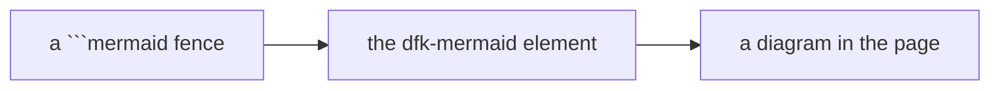

# Mermaid diagrams

A ```` ```mermaid ```` fence becomes a diagram, rendered in the browser by the
kit's `<dfk-mermaid>` element:



## Wiring

One entry in the docs preset's `remarkPlugins`, and nothing else:

```ts
import {remarkMermaid} from 'duckfn-docs-kit/mermaid/remark';

export default {
  presets: [
    [
      'classic',
      {
        docs: {
          remarkPlugins: [remarkMermaid],
        },
      },
    ],
  ],
};
```

**Do not install `@docusaurus/theme-mermaid`**, do not list it in `themes`, and do
not set `markdown.mermaid`. The kit's element replaces all three; leaving the
theme in place would put two renderers on the same fence.

## Why the kit renders it instead

Two upstream defects are structural in the theme's React component, and neither
can be fixed from `docusaurus.config.ts` or from the diagram source:

- **A dark-mode first load flashed.** The theme colours by `useColorMode()`, whose
  value deliberately lags on the first client render, so a dark page painted a
  *light* diagram first and a dark one immediately after. The two also overlapped
  inside mermaid's mutable singleton, which occasionally resolved to an empty
  diagram with no error.
- **Two diagrams could not render at once** — mermaid is one mutable singleton.

The element reads the colour mode from `<html data-theme>` (written before the
first paint) and renders every diagram through one page-wide queue, so each
diagram is rendered exactly once per mode, in the mode the page is really in.

## The palette

The default is the `neo` look with the redux palette — `redux-color` in light
mode, `redux-dark-color` in dark. A site overrides it in its own config:

```ts
remarkMermaid({
  config: {theme: {light: 'neutral', dark: 'dark'}, options: {look: 'classic'}},
});
```

`theme` is per colour mode; `look` has no light/dark counterpart and goes through
`options`. Mermaid **silently ignores** a value it does not recognise and falls
back — so check a diagram in a browser, not by the build. (`node` elements carry
`data-look`, which is the quick way to confirm the look took.)

## What the reader gets

Hovering a diagram reveals four buttons in its top-right corner:

| Button | What it does |
| --- | --- |
| Reset zoom | Back to fit. The wheel zooms and dragging pans, but panning only engages once the diagram is zoomed — so the page keeps scrolling normally over a diagram that fits. |
| Fullscreen | Fills the viewport; <kbd>Esc</kbd> exits. |
| Edit source | Opens the mermaid source in a CodeMirror dialog. **Apply** re-renders; the change is local to the page. |
| Download SVG | Saves the diagram as an `.svg` file, at the size mermaid produced it. |

## Notes

- **Diagrams render on the client**, so a syntax error appears in the page
  (with mermaid's own message) rather than failing the build.
- Keep labels quoted (`A["text"]`), use `<br/>` for a line break, and avoid a bare
  `#` or an unescaped `&`.
- A ```` ```mermaid ```` fence **inside a longer fence** — documenting it, as this
  page does — stays text; it is not turned into a diagram.
- A runnable SQL block can emit a diagram too: `"show": "mermaid"` hands the
  result's column to this same element — see
  [Runnable SQL blocks](./runnable-sql.md).