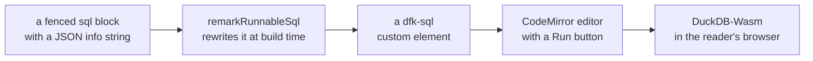

# Runnable SQL blocks

A fenced SQL block whose info string carries a JSON config turns the code block
into a runnable example: the block itself is a CodeMirror editor, and nothing
executes until you click **Run**. The buttons (Run, Run all, Format, Reset, line
wrapping, Copy) appear in the block's top-right corner when you hover it or tab
into it; **Format** re-lays-out the SQL in place — whitespace only, your keyword
casing is kept. The query runs in your browser against a single shared
DuckDB-Wasm instance, and the result renders below the block.

**Run all** runs every runnable block on the page, in page order and one at a
time — useful on a page that draws a figure from a stack of blocks, where
clicking Run on each of them is busywork.

DuckDB itself starts initialising in the background as soon as a page with a
block opens, so the first **Run** click does not wait for the download.

The editor and the result table are the two heavy parts of a block, and each
arrives as its own chunk. Until CodeMirror is there, the code area carries one
placeholder bar per line of SQL; while VTable loads, a table result carries two
placeholder rows. Both are the size of the thing they stand in for, so the swap
itself adds no height — the one exception is a line of SQL long enough to wrap in
the editor, which a placeholder cannot predict.

The config is JSON (not `key=value`), so it can grow nested fields later:

````md
```sql {"type":"duckfn","show":"table"}
SELECT * FROM range(10);
```
````

At build time the block goes through a short pipeline before it reaches the reader:



## Works in `.md`, not just `.mdx`

A runnable block needs no MDX feature: the JSON metastring is read by the
`remarkRunnableSql` remark plugin during the build, which rewrites the block
into the `<dfk-sql>` custom element *before* either format is compiled — so a
plain `.md` page behaves exactly like an `.mdx` one, and this page itself is
`.md`:

```sql {"type":"duckfn"}
SELECT 40 + 2 AS answer;
```

## The smallest example

`show` may be left out; a single scalar result opens on a `Text` tab instead of
a table.

```sql {"type":"duckfn"}
SELECT 1;
```

## A plain query

```sql {"type":"duckfn","show":"table"}
SELECT *
FROM range(10)
WHERE range > 5;
```

## Multiple statements

When the block holds several statements, the **last one's** result is shown —
handy for a `SET` / `CREATE` preamble before the query you actually want to
see. Use it for a preamble, not for a stack of independent examples: everything
but the last answer stays invisible, so each example gets a block of its own.

```sql {"type":"duckfn","show":"table"}
CREATE TABLE t AS SELECT * FROM range(5) r(i);
SELECT i * 10 AS ten FROM t ORDER BY i DESC;
```

## Errors stay put

Run a failing statement and the error appears in the result area; whatever you
typed in the editor is kept, nothing resets.

```sql {"type":"duckfn","show":"table","expect":"error"}
-- error on purpose: this block declares "expect": "error"
SELECT this_function_does_not_exist(1);
```

## HTML reports (`show: "html"` / `show: "iframe"`)

`html` and `iframe` are the same renderer: the markup is put into an iframe's
`srcdoc`, one tab per row, with the raw rows kept in a `Table` tab that is
always **last**. `field` names the column holding the markup (a single-column
result is unambiguous and needs no `field`), and `tab_name` picks the column
that labels each tab.

The frame is sandboxed with `allow-scripts` and **without** `allow-same-origin`,
so a report's JavaScript runs while the frame keeps an opaque origin. That is
what makes an HTML report — charts and all — work here; widen it only
deliberately, through `option.sandbox`.

```sql {"type":"duckfn","show":"iframe","field":"html","tab_name":"label","option":{"height":"170px"}}
SELECT * FROM (VALUES
  ('Bars', '<!doctype html><meta charset="utf-8"><body style="font:14px system-ui;margin:0;padding:12px"><h4 style="margin:0 0 8px">Quarterly revenue</h4><svg viewBox="0 0 240 80" width="240" height="80"><rect x="0" y="20" width="60" height="60" fill="#14459b"/><rect x="80" y="40" width="60" height="40" fill="#3d7bd6"/><rect x="160" y="10" width="60" height="70" fill="#8ab4f8"/></svg></body>'),
  ('Script', '<!doctype html><meta charset="utf-8"><body style="font:14px system-ui;margin:0;padding:12px"><h4 style="margin:0 0 8px">Scripts run</h4><p id="out"></p><script>document.getElementById("out").textContent = "this frame ran JavaScript, with an opaque origin";</script></body>')
) AS t(label, html);
```

## Inline SVG (`show: "svg"`)

`svg` splices the markup into the page instead of framing it — the panel is
still one tab per row plus the trailing table. Because inline SVG shares the
page, anything that could execute or navigate (scripts, `foreignObject`,
`on*` handlers, `javascript:` links) is stripped before it is inserted. The
figure itself behaves like a diagram: zoom and pan switch on in fullscreen, and
**Edit source** opens the markup in a dialog to apply and re-render.

**A figure wider than the column is scaled down to fit it, and the panel's
height follows the figure's aspect ratio** — a figure that already fits keeps
its natural size, nothing is enlarged. That relies on the markup carrying a
`viewBox`, which is what makes an SVG scalable at all; a root that declares only
a `width` and `height` (what most plotting libraries emit) is given
`viewBox="0 0 <width> <height>"` on the way in. Without a `viewBox` the drawing
would keep its own size however narrow the box got, and its right-hand side
would simply be cut off. `width="100%"` cannot be turned into a `viewBox` and is
left as written.

```sql {"type":"duckfn","show":"svg","option":{"height":"140px"}}
SELECT '<svg xmlns="http://www.w3.org/2000/svg" viewBox="0 0 260 100" width="260" height="100"><circle cx="50" cy="50" r="40" fill="#14459b"/><circle cx="120" cy="50" r="30" fill="#3d7bd6"/><text x="170" y="56" font-family="system-ui" font-size="16" fill="#181818">from SVG</text></svg>';
```

## Mermaid diagrams (`show: "mermaid"`)

`mermaid` renders the column's source as a diagram, through the very same
`<dfk-mermaid>` element a ```` ```mermaid ```` fence produces — so a query can
build a diagram, and the reader gets the element's zoom, source editing and SVG
download with it. Embedded like this, the element adds neither a frame of its own
nor a floating button cluster: the result area already draws both, so **Reset
zoom** and **Edit source** move to the tab strip and the diagram zooms in the
result's fullscreen. As with the other previews, there is one tab per row and the
raw rows stay in the trailing `Table` tab.

```sql {"type":"duckfn","show":"mermaid"}
SELECT 'flowchart LR' || chr(10)
  || '  A["a SELECT"] --> B["one result cell"]' || chr(10)
  || '  B --> C["a diagram"]' AS diagram;
```

## Loading extensions

The extension this site documents is preloaded on every page, so the examples
here just call into it — see [Preloaded extensions](./preloaded-extensions.md)
for the ordered preload list. A block that needs something more can still name
it: `extensions` lists what to `LOAD` before the block runs, and `repository`
points at a different source — `community`, `core` or a repository URL. Both
are per block, while the loaded set is shared by every block on the page.

```sql {"type":"duckfn","show":"table","extensions":["inet"]}
-- Cast to VARCHAR: the wasm bridge hands INET to the page as a struct.
SELECT '127.0.0.1'::INET::VARCHAR AS ip, '10.0.0.0/8'::INET::VARCHAR AS network;
```

An extension whose signature does not verify is rejected unless
`allowUnsignedExtensions` is on — a third-party release asset is not signed
with DuckDB's keys — and the *first* block that initialises the shared runtime
settles the instance either way.

## The strip at the right of the tabs

Every result carries the same tab strip — a plain table result included — and its
right end holds the whole-result chrome: the **active tab's own controls**, a
**Download** button and the fullscreen toggle. The controls belong to the tab, so
they appear and disappear with it:

| Tab | Controls |
| --- | --- |
| `Table` | Search, Copy table, column-width mode, Reset view, Unfreeze columns |
| `svg` / `mermaid` | Reset zoom, Edit source |
| `html` / `iframe` / `text` | — |

The table's controls are the whole-table half of its right-click menu, kept where
they cannot cover a cell; the menu itself still has the per-cell entries (copy this
cell, wrap this column, freeze up to here). **Unfreeze columns** only appears once
a column has actually been frozen — freeze from the menu to get there — and goes
away again when none are.

**Download** saves whatever the active tab shows, in the format that tab has:
`.csv` for a table, `.svg` for a figure, `.html` for a prepared frame, `.txt` for
text. It is hidden only while there is nothing to save yet (a figure that has not
finished rendering).

The fullscreen toggle sits at the very end. Clicking it fills the viewport with
the result, and the same button (now *Exit fullscreen*) stays in place.
<kbd>Esc</kbd> exits too. Fullscreen is also the only place a figure zooms and
pans — see [Mermaid diagrams](./mermaid.md) for what the pointer does there.

```sql {"type":"duckfn","show":"table"}
SELECT i AS n, repeat('wide column ', 3) AS filler
FROM range(40) t(i);
```

## Searching a table

A table result is as wide as the page, so its search box opens *inside the tab
strip* rather than floating over the cells it is meant to find. Typing highlights
every match and the counter (`3/12`) says where you are; the arrows step through
them and the last button clears the field. Searching is per table result and
starts over on the next one.

```sql {"type":"duckfn","show":"table"}
SELECT i AS n, 'row ' || i AS label, i % 3 AS bucket
FROM range(20) t(i);
```

## Config reference

| Field | Meaning |
| --- | --- |
| `type` | `"duckfn"` — marks the block as runnable. Required. |
| `show` | `table` (default), `text`, `html`, `iframe`, `svg`, `mermaid`. |
| `expect` | `ok` (default) or `error` — what the docs' [SQL test](./sql-test.md) requires of this block; `error` marks one that demonstrates a failure. |
| `field` | Column holding the markup, for `html` / `iframe` / `svg` / `mermaid`. |
| `tab_name` | Column labelling each preview tab. |
| `option.width` · `option.height` | CSS lengths for the preview box. |
| `option.sandbox` | Sandbox tokens for the iframe, replacing `allow-scripts`. |
| `extensions` | Extension names to `LOAD` before running, on top of the site-wide preloads. |
| `repository` | Where those extensions come from: `community`, `core` or a repository URL. |
| `allowUnsignedExtensions` | Accept an unverifiable signature (site-wide via the preload config, or per block; the first block to initialise settles it). |

## Ordinary code blocks are untouched

Only blocks whose metastring parses as JSON with `"type":"duckfn"` become
runnable. A plain SQL block renders as a normal code block:

```sql
SELECT 'just documentation, no run button';
```
