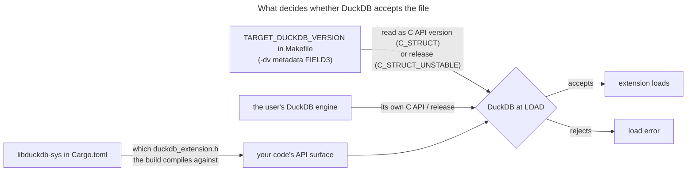

# Version numbers and the ABI

A duckfn extension never links DuckDB: it calls through the C API's function table, and DuckDB itself
decides at `LOAD` time whether the file is acceptable. Three different numbers take part in that
decision, and only one of them is the "DuckDB version" people usually mean. Which side you take on
each of them is what decides whether one build serves a range of DuckDB releases or exactly one.

## The three numbers



| Number | Where it is set | What it means |
| --- | --- | --- |
| The **release the headers come from** | `libduckdb-sys` in `Cargo.toml` (resolved in `Cargo.lock`) | Which `duckdb_extension.h` the build compiles against — the API surface your code may call. |
| The **value written into the metadata** | `TARGET_DUCKDB_VERSION` in the `Makefile`, handed to `append_extension_metadata.py` as `-dv` | Read as a **C API version** under `abi_type = C_STRUCT`, and as a **release** under `C_STRUCT_UNSTABLE`. |
| The **engine that loads the file** | the user's DuckDB | Its own C API level (or release) is what your declaration is checked against. |

The workflow's `duckdb_version` — and the `DUCKDB_VERSION` it also exports — is a fourth, unrelated
knob: it picks which DuckDB source the distribution pipeline checks out, which engine the
sqllogictest run uses, and what the artifacts are named. It never reaches your extension.

## `C_STRUCT` vs `C_STRUCT_UNSTABLE`

`USE_UNSTABLE_C_API` in the `Makefile` decides which of the two ABI types the metadata claims, and
*that* is what makes the `-dv` value mean two different things.

**`USE_UNSTABLE_C_API=0` → `abi_type = C_STRUCT`.** The declaration is a **floor**, and the loader
compares C API versions:

```text
The file was built for DuckDB C API version '<declared>', but we can only load extensions built for
DuckDB C API '<engine>' and lower.
```

An engine whose C API is at or above your floor loads the file; its exact release does not matter.
That is the portability you want, and it costs nothing as long as your code stays inside the stable
region of the C API.

**`USE_UNSTABLE_C_API=1` → `abi_type = C_STRUCT_UNSTABLE`.** Now the declaration is a **release** and
the engine demands a literal match. The unstable part of the extension API is a C struct addressed by
slot order, so a build compiled against a different set of slots cannot run: one file, one engine.

`append_extension_metadata.py`'s own help text spells the split out: *"The DuckDB version to encode,
depending on the ABI type this encodes the duckdb version or the C API version."*

## Where the values come from

Two files carry the settings — the headers come from `Cargo.toml`, the declaration from the
`Makefile`:

```toml
# Cargo.toml — the headers
libduckdb-sys = { version = ">=1.10500, <2", features = ["loadable-extension"] }
```

`libduckdb-sys` encodes a DuckDB release as `1.<major*10000 + minor*100 + patch>.0`, so `1.10506.0`
is DuckDB 1.5.6 and the `>=1.10500` above means "DuckDB 1.5 headers or newer".

Nothing else rewrites the `Makefile` line: ci-tools' `set_duckdb_version` is a no-op for C API
extensions, and the community registry's `duckdb_version` only chooses which DuckDB source to check
out, how the artifacts are named and which version directory they are deployed into. It is yours to
maintain — see [Build and release](../development/build-and-release.md). The next section gives both
complete sets.

## Choosing for your own extension

One question decides it: **does your code touch the unstable region?**

- It holds copy functions, the host file system (`duckfn::duck_vfs`), the scalar `bind` / `init`
  slots, `varargs`, and the logical types DuckDB gained in 1.5 (today `TIME_NS`). duckfn groups all
  of it behind the `duckdb-1-5` feature; `owned-connection` (the host VFS) implies it.
- Everything else is in the stable region: scalars, aggregates, table functions, casts, replacement
  scans, SQL macros, named STRUCT / ENUM types, and the chrono / uuid / rust_decimal bridges.

### Stable region — the complete set

```make
# Makefile
EXTENSION_NAME=my_extension
USE_UNSTABLE_C_API=0
TARGET_DUCKDB_VERSION=v1.2.0
```

```toml
# Cargo.toml — the ABI point is that `duckdb-1-5` stays off (`cli` is only for the
# `function_descriptions` bin and has nothing to do with the ABI).
duckfn = { version = "{{DUCKFN_VERSION}}", features = ["cli"] }
```

```yaml
# .github/workflows/MainDistributionPipeline.yml
      duckdb_version: v1.5.6     # any engine at or above the floor; the newest is the safe pick
```

- `TARGET_DUCKDB_VERSION` is a **C API floor**, not a release — that is what the mode buys.
  `v1.2.0` is where DuckDB 1.3.2 through 1.5.5 all sit, so one artifact covers them (measured, below).
- **`export QUACK_RS_TARGET_DUCKDB_VERSION` is deliberately absent here, and adding it would not
  help.** quack-rs reads that variable only in the unstable path: `abi::check()` returns `StableOnly`
  before it ever calls `built_against_version()`, whenever `uses_unstable_api()` — i.e.
  `cfg!(feature = "duckdb-1-5")` — is false.
- `DUCKDB_TEST_VERSION` is absent for the same reason: the test runner may be any newer engine,
  because every engine at or above the floor accepts the artifact.

### Unstable region — the complete set

```make
# Makefile
EXTENSION_NAME=my_extension
USE_UNSTABLE_C_API=1
TARGET_DUCKDB_VERSION=v1.5.6
export QUACK_RS_TARGET_DUCKDB_VERSION=$(TARGET_DUCKDB_VERSION)
DUCKDB_TEST_VERSION := $(patsubst v%,%,$(TARGET_DUCKDB_VERSION))
```

```toml
# Cargo.toml
duckfn = { version = "{{DUCKFN_VERSION}}", features = ["duckdb-1-5"] }   # + "owned-connection" for duckfn::duck_vfs
```

```yaml
# .github/workflows/MainDistributionPipeline.yml
      duckdb_version: v1.5.6     # must equal TARGET_DUCKDB_VERSION; it is the engine `make test` loads into
```

- **The `export` keyword is part of the line, not decoration.** quack-rs' build script reads
  `QUACK_RS_TARGET_DUCKDB_VERSION` from the *environment*, and `make` does not put a variable there
  unless it is exported. Drop `export` and cargo sees nothing — no error, just an empty value, and
  the layout check then falls back to quack-rs' own table, which is exactly what rejects the engine
  when it is a release quack-rs has not catalogued yet.
- `TARGET_DUCKDB_VERSION` is a **release** in this mode and the engine has to match it literally —
  which is why the test-runner pin (`DUCKDB_TEST_VERSION`) and the CI pin move together with it.
- Going back to the stable side means dropping all three version-flavoured lines at once: the
  `export`, the `DUCKDB_TEST_VERSION` derivation, and the CI pin's "must equal" requirement.

The one trap that survives in either mode:

- **Do not turn `duckdb-1-5` on while claiming `C_STRUCT`.** The loader only checks what you declared,
  so the file would be accepted by engines whose unstable layout differs — and the mismatch would show
  up as undefined behaviour instead of a load error. Pick one side and match the feature to it.

### What a stable build actually covers

`v1.2.0` is the C API level DuckDB 1.3.2 through 1.5.5 all sit at, so one stable build declaring it is
accepted across the whole range. Measured with a single artifact, each engine loading it and running a
real call:

| Declared C API floor | Engines that took the same binary |
| --- | --- |
| `v1.2.0` | 1.3.2, 1.4.0, 1.4.5, 1.5.0, 1.5.5, 1.5.6, 2.0.0 (pre-release) |

DuckDB 2.0 is close (see its release calendar), and a stable build declaring `v1.2.0` already loads and
runs there — verified by loading such an extension into a 2.0 pre-release and calling its functions (an
aggregate and a scalar both returned the expected values). The floor is what buys that portability: do
not read "runs on 2.0" as "was compiled against 2.0".

One 2.0 naming trap: DuckDB ships a **second, v2 C API** (`duckdb_v2.h`) — a genuinely different,
still-rapid surface that the experimental `duckdb-neo` wrapper targets. It does **not** replace the v1
API for extensions: a loadable extension builds on the v1 C API (`libduckdb-sys`'s default `capi-v1`
feature, required by `loadable-extension`), and that v1 surface is exactly what 2.0 still loads. So "C
API v2 is different" is about the *new header*, not about v1 extensions losing compatibility. Mind the
version encoding too: DuckDB 2.0.0 maps to a `libduckdb-sys` crate version `1.20000.x` (format
`1.<major*10000 + minor*100 + patch>.x`) — still a `1.x`, so a `>=1.10500, <2` constraint selects it.
The `<2` bound is not the blocker; moving your release line onto 2.0 is gated by it being *released* (a
stable `v2.0-cyanoptera` ci-tools ref and real `duckdb-shared-libs` assets), not by a crate version bound.

Raise the floor only when you genuinely need newer headers. And raise it by the *C API version*, not
by a release number: writing `v1.5.6` there leaves exactly that engine willing to take the file.

## Checking a build yourself

`make debug` prints the metadata it just wrote, which is the quickest way to see what you actually
declared rather than what you meant to:

```text
FIELD2 = windows_amd64
FIELD3 = v1.2.0          # the declared version
FIELD5 = C_STRUCT        # the ABI type
```

Then take that one artifact and load it into several engines — a locally built extension always needs
`-unsigned`:

```shell
duckdb -unsigned -c "LOAD '<path>/my_extension.duckdb_extension'; SELECT my_greet('world');"
```

Two traps come up here:

- **A pinned test runner is not the engine under test.** `make configure` builds `configure/venv`
  once and never refreshes the Python `duckdb` inside it (the recipe hangs off the directory, so a
  second `make` skips it), and a stale runner refuses a freshly built extension. Upgrade it in place —
  these are the two paths `base.Makefile` itself uses:

```shell
configure/venv/Scripts/python.exe -m pip install --upgrade "duckdb==1.5.6"   # Windows
configure/venv/bin/python3       -m pip install --upgrade "duckdb==1.5.6"   # Linux / macOS
```

- **The header pin and the engine are separate.** Updating `libduckdb-sys` changes what you may call,
  not what will load you — and vice versa.

## WebAssembly (loading)

The same rules apply, with one extra caveat: the engine is fixed inside the DuckDB-Wasm bundle, so
you cannot pick it at `LOAD` time. An unstable build therefore has to be served by the exact dev build
carrying the matching release, while a stable build only needs an engine at or above its floor. How
this site pins that build is in [Preloaded extensions](../docs-kit/preloaded-extensions.md).

How the `wasm_*` artifacts are *built* — the Rust the CI installs, the emsdk/binaryen it pins, and the
ci-tools ref they come from — is a different version story, covered in
[The wasm build toolchain](./wasm-toolchain.md).

## Release assets vs the community registry

`LOAD '<url of a release asset>'` fetches exactly the file you name, so "one binary across releases"
is entirely your declaration's doing. The community registry works differently: it hands out the
build for the DuckDB version the *client* reports, from a directory tree the registry fills in itself
— see [Community extension docs](../community-extension-docs.md). That makes the registry route
version-directed rather than version-tolerant, whatever you declared.

## See also

- [The wasm build toolchain](./wasm-toolchain.md) — the Rust / emsdk / ci-tools version coupling behind `wasm_*`.
- [Rust unwinding on WebAssembly](./rust-wasm-unwinding.md) — why `panic!` behaves differently by Rust version.
- [Installation](../getting-started/installation.md) — what each duckfn feature requires of DuckDB.
- [File system](../guide/file-system.md) and [Copy functions](../guide/copy-functions.md) — the two
  capabilities that live in the unstable region.
- [Build and release](../development/build-and-release.md) — the build paths and the release flow.
- [Known issues](../known-issues.md) — upstream bugs that are not about versions.
