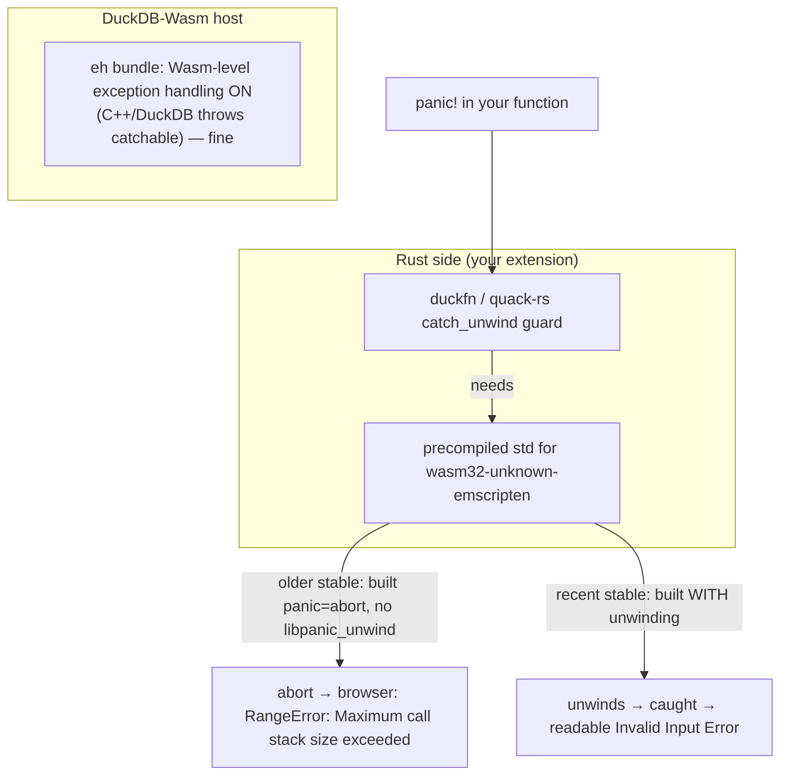

# Rust unwinding on WebAssembly

duckfn and quack-rs wrap every callback in `std::panic::catch_unwind`, so a `panic!` inside your function
becomes a readable DuckDB error instead of crashing. Whether that safety net is *real* on WebAssembly
depends on the `rustc` version. This is the measured story.

## The two layers



The host layer (wasm-level EH) has always been there — enabling `wasm_eh` or `emcc -fwasm-exceptions`
is **not** the lever, and cannot revive a `panic!` Rust already compiled to `abort`. The missing piece
has always been *Rust's own* unwinding runtime, which lives in the target's precompiled `std`.

## The probe experiment

Two throwaway scalar functions were added, the wasm extension built, and the same query run in the
browser through the docs harness (`just test_wasm` → Playwright → `@duckdb/duckdb-wasm 1.33.1-dev65.0`
≈ emsdk 3.1.71). Only the `rustc` was swapped (`rust-toolchain.toml` / `RUSTUP_TOOLCHAIN`), emsdk held
constant:

```rust
#[duck_scalar_function(/* … */)]
fn sr_probe_panic(_x: f64) -> DuckOptionResult<f64> {
    panic!("PROBE_PANIC_MARKER");            // relies on duckfn's own catch_unwind
}

#[duck_scalar_function(/* … */)]
fn sr_probe_catch(_x: f64) -> DuckOptionResult<f64> {
    match std::panic::catch_unwind(|| panic!("PROBE_INNER")) {
        Ok(_)  => Ok(Some(0.0)),
        Err(_) => Err(duck_error("PROBE_CAUGHT_UNWIND_OK")),  // catches it directly
    }
}
```

| stable rustc | a bare `panic!` | `catch_unwind` |
| --- | --- | --- |
| **1.89** | `RangeError: Maximum call stack size exceeded` (aborts) | **no** — nothing to unwind |
| **1.97.1** | `Invalid Input Error: PROBE_PANIC_MARKER` | **yes** — returns `PROBE_CAUGHT_UNWIND_OK` |

On 1.89 both probes came back as the stack-overflow `RangeError`; on 1.97.1 the bare `panic!` surfaced
as a clean `Invalid Input Error: PROBE_PANIC_MARKER` (the framework's `catch_unwind` caught it) and the
self-contained `catch_unwind` returned its marker — unwinding is genuinely present.

## Why the version matters

rustup's precompiled `std` for `wasm32-unknown-emscripten` used to be built `panic = "abort"` with no
`libpanic_unwind`, so there was no unwinder to run and every `panic!` aborted. A **recent stable** now
ships that target's `std` **with** unwinding, so `catch_unwind` works in the browser too. This removes
the old need for `RUSTFLAGS="-Cpanic=unwind" cargo +nightly build -Zbuild-std=std,panic_unwind …`
(nightly-only rebuild of `std`) — a current stable is enough.

## What to do

- **Prefer the recoverable path regardless of toolchain.** Return `Err(duck_error("..."))` /
  `DuckOptionResult` for anything a caller can react to — it never unwinds and is a clean
  `Invalid Input Error` on both native and wasm.
- Keep `panic!` for genuine "must abort the process" internal bugs. On wasm it will only read as a
  stack overflow unless you are on a recent-enough stable; do not rely on it for user-facing errors.
- If you need `catch_unwind` to actually fire on wasm (e.g. to keep a `panic!`-heavy dependency from
  taking down a call), pin a recent stable in [rust-toolchain.toml](./wasm-toolchain.md) — the same file
  that fixes the wasm compile MSRV — and keep the `-O0` link override.

## See also

- [The wasm build toolchain](./wasm-toolchain.md) — the Rust / emsdk / ci-tools version coupling.
- [DuckDB version compatibility](./index.md) — which DuckDB the binary targets.
- [Known issues](../known-issues.md) — the remaining non-version upstream bugs.
