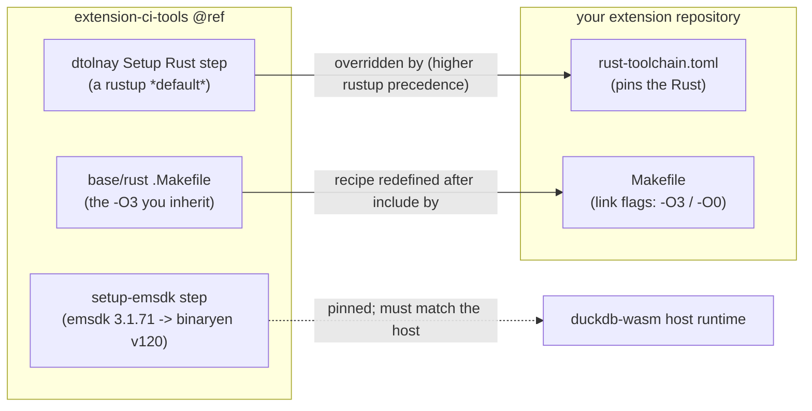
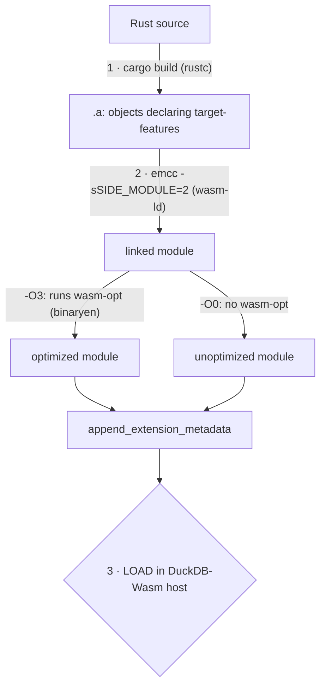
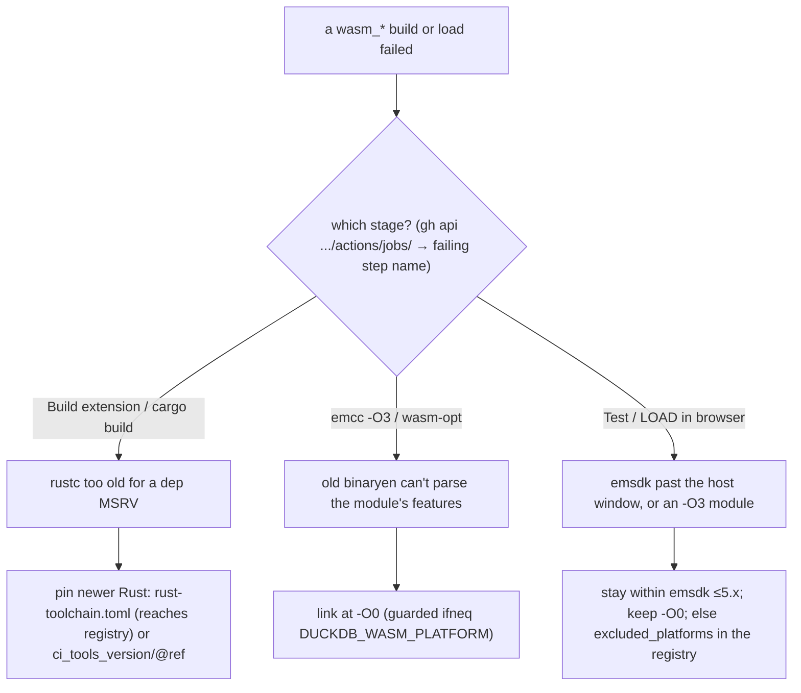

# The wasm build toolchain

[Version numbers and the ABI](./c-api-and-abi.md) is about which **DuckDB** a binary targets. Producing the `wasm_*`
artifacts is a different, nastier version problem: three knobs have to line up, **each set in a
different repository**, and a mismatch fails at one of three distinct stages. This page records the
whole investigation — the failure modes, the measured compatibility windows, and the levers — so nobody
has to re-derive it.

## The three knobs, and who sets them



| Knob | Who sets it | What it controls |
| --- | --- | --- |
| The **Rust toolchain** the wasm build installs | the ci-tools ref you call (`uses: .../_extension_distribution.yml@<ref>` and the `ci_tools_version` input), overridable by a repo `rust-toolchain.toml` | whether `cargo build` will even accept your dependency tree |
| The **emsdk / binaryen** (`3.1.71` → `wasm-opt` v120) | ci-tools' `setup-emsdk` step | which wasm features `emcc`'s post-link optimizer understands |
| The **link flags** (`-O3` vs `-O0`) | **your `Makefile`** (`link_wasm_release` / `link_wasm_debug`) | whether that optimizer runs at all |

The first two are pinned by the official pipeline. The emsdk pin must match the engine baked into the
DuckDB-Wasm host, or the module will not `LOAD` — so it is effectively fixed (see the compatibility
window below for exactly how much slack it has).

## The build is a pipeline, and it can break at three points



1. **Compile** — a dependency needs a newer `rustc` than the CI installs.
2. **Link** — `emcc -O3` feeds newer target-features to a binaryen that cannot parse them.
3. **Load** — the module (from too-new an emsdk, or from `-O3`) is rejected by the host runtime.

### 1 · Compile: the Rust pin (the "Rust 1.86" saga)

The reusable workflow installs a specific Rust for the wasm job, and it historically **lagged the native
job**: the native build used `stable` (1.97.1) while the wasm "Build Wasm module" / "Setup Rust for
cross compilation" step pinned `dtolnay/rust-toolchain@1.86.0`. Any dependency needing a newer
language feature then failed *only* the `wasm_*` job while `linux_amd64`, `osx_*`, `windows_*` passed:

```text
error: rustc 1.86.0 is not supported by the following packages:
  <crate> requires rustc 1.89
```

— before it ever reaches `emcc`. This was ci-tools [issue #385](https://github.com/duckdb/extension-ci-tools/issues/385),
closed by [PR #394](https://github.com/duckdb/extension-ci-tools/pull/394), which raised the wasm Rust
to 1.97.1 and unified it with the native job. **But the bump only lives in a ci-tools ref at/after
#394** — a ref like `@v1.5-variegata`, cut before the merge, still carries `1.86.0`.

Two levers, at different layers:

- **Bump `ci_tools_version` / `@ref`** to a ref carrying the fix. Simple, upstream-sanctioned — but it
  only reaches *your own* release pipeline.
- **Drop a repo `rust-toolchain.toml`** (`channel = "1.97.1"`, `targets = ["wasm32-unknown-emscripten"]`).
  The `dtolnay/rust-toolchain` action only sets a rustup **default**, and a `rust-toolchain.toml`
  outranks that default, so `cargo` uses the pinned toolchain (rustup auto-installs it). Because the
  file lives in the repo, it also travels with the community-registry's `override_ref` — which a
  `ci_tools_version` bump cannot (see below).

### 2 · Link: modern Rust emits features old binaryen cannot parse

Recent Rust (`>=1.89`) building for `wasm32-unknown-emscripten` emits a module that declares post-MVP
target-features — `exception-handling`, `bulk-memory-opt`, and, once the module is big enough (many
distinct function types → an overlong indirect-call table), `call-indirect-overlong`. `emcc` reads those
declarations and forwards them to `wasm-opt` as `--enable-*`. emsdk 3.1.71 ships binaryen v120, which
does not recognise the newer names, so `emcc -O3` dies:

```text
Unknown option '--enable-bulk-memory-opt'
emcc: error: '...wasm-opt ... --enable-call-indirect-overlong ...' failed (returned 1)
```

`wasm-opt` is only an **optimizer**; the `wasm-ld` module is valid on its own and loads fine in
DuckDB-Wasm. So the escape that keeps full functionality is to **skip the optimizer**: override the link
to `-O0` in your `Makefile`, placed *after* the `include` so it wins over `base.Makefile` — and under
the **same** `ifneq ($(DUCKDB_WASM_PLATFORM),)` guard base uses, or you also redefine the (empty) native
target and linux/macos/windows builds fail with `emcc: command not found`:

```make
# Makefile, after include extension-ci-tools/.../base.Makefile
ifneq ($(DUCKDB_WASM_PLATFORM),)
link_wasm_debug:
	emcc $(EXTENSION_BUILD_PATH)/debug/$(EXTENSION_LIB_FILENAME) -o $(EXTENSION_BUILD_PATH)/debug/$(EXTENSION_FILENAME_NO_METADATA) -O0 -g -sSIDE_MODULE=2 -sEXPORTED_FUNCTIONS="_$(EXTENSION_NAME)_init_c_api"

link_wasm_release:
	emcc $(EXTENSION_BUILD_PATH)/release/$(EXTENSION_LIB_FILENAME) -o $(EXTENSION_BUILD_PATH)/release/$(EXTENSION_FILENAME_NO_METADATA) -O0 -sSIDE_MODULE=2 -sEXPORTED_FUNCTIONS="_$(EXTENSION_NAME)_init_c_api"
endif
```

### 3 · Load: the host only accepts a window of emsdk versions, and only `-O0` output

Loading a side module into DuckDB-Wasm needs its emscripten runtime imports to line up with the host's.
Measured against the pinned host `@duckdb/duckdb-wasm 1.33.1-dev65.0` (built with ~3.1.71) — building
the same `duckfn_statrs` `.a` and linking it with different emsdk clones, then running the browser
harness (`just test_wasm` → Playwright → DuckDB-Wasm), changing **only** the emsdk and the `-O` level:

**emsdk version, at `-O0`:**

| extension linked with | builds? | loads in the host? |
| --- | --- | --- |
| emsdk 3.1.74 | ✓ | ✅ all 554 docs examples pass |
| emsdk 4.0.23 | ✓ | ✅ all 554 pass |
| emsdk 5.0.7 | ✓ | ✅ all 554 pass |
| emsdk 6.0.0 | ✓ | ❌ `Could not load dynamic lib` |
| emsdk 6.0.10 | ✓ | ❌ `Could not load dynamic lib` |

**optimization level (same emsdk, in the compatible window):**

| emsdk | `-O0` (skip binaryen) | `-O3` (binaryen-optimized) |
| --- | --- | --- |
| 4.0.23 | ✅ loads, all pass | ❌ `Could not load dynamic lib` |
| 5.0.7 | ✅ loads, all pass | ❌ `Could not load dynamic lib` |

Two independent, additive conclusions:

- **The emsdk pin is a window, not an exact match.** The whole `5.x` line loads; the break is a clean
  emscripten **5 → 6** boundary (`5.0.7` loads, `6.0.0` does not). `-sSIDE_MODULE=2` itself never
  errored, even on 6.x — it is the *resulting module* the host rejects.
- **`-O0` is load-critical, not just an old-binaryen workaround.** An `-O3` module links fine with the
  newer binaryen (which accepts the feature flags) yet the host rejects it, while `-O0` from the *same*
  toolchain loads. Revisit `-O3` only once the **host's** wasm runtime (not just the extension's emsdk)
  is known to accept binaryen-optimized side modules. Incidentally the `-O3` output was *larger*
  (~1.93 MB vs ~1.52 MB) — binaryen optimizes for speed here, not size.

## CI ignores your `extension-ci-tools` submodule

The submodule is only the source of the makefiles for **local** `just build` / `make` / `just test_wasm`.
GitHub CI ignores your submodule's pinned commit: it fetches the reusable workflow at `uses: ...@<ref>`
and re-checks-out `extension-ci-tools` into the same path at `ci_tools_version`. So the wasm toolchain
you exercise locally can differ from the one CI (and the registry) use — keep the local submodule ref,
the `@ref`, and `ci_tools_version` aligned, or "green locally" will not mean "green in CI".

## The community registry build uses its own pins

`duckdb/community-extensions/.github/workflows/build.yml` calls `_extension_distribution.yml` at **its
own** ci-tools ref / `ci_tools_version` default, passing only `override_repository` + `override_ref`
(your repo and commit SHA). Your project's `ci_tools_version` therefore reaches neither the registry nor
its Rust choice — so if the registry's pinned Rust is below your dependency MSRV, its wasm job fails the
same way. Bumping `ci_tools_version` cannot help, but a repo `rust-toolchain.toml` **does** reach the
registry (it travels with `override_ref`). The project-side levers are therefore: pin the Rust with
`rust-toolchain.toml`, or exclude wasm in `description.yml`:

```yaml
extension:
  excluded_platforms: "wasm_mvp;wasm_eh;wasm_threads"
```

Drop that line once the registry moves past #394. See [Community extension docs](../community-extension-docs.md).

## Diagnosing your own case



- Compare two `.a` archives byte-for-byte for the feature strings (`bulk-memory-opt`,
  `call-indirect-overlong`, `exception-handling`) to see which artifact asks for a newer binaryen.
- Confirm the Rust actually in play per directory: `rustc --version`, `rustup override list`, and note
  that a `rust-toolchain.toml` outranks the CI action's rustup default.
- In CI: `gh run view <id> --json jobs` for per-platform conclusions, `gh api .../actions/jobs/<job>`
  for the failing **step name** (compile vs link vs test), `gh run view --job=<id> --log` once the run
  finishes.

## Worked example: `duckfn_statrs`

`duckfn_statrs` wraps `statrs 0.19` / `nalgebra 0.35` (rustc ≥ 1.89). On `@v1.5-variegata` its wasm job
failed at #385's 1.86. The adopted fix stays on `v1.5-variegata` and overrides Rust **from the repo** —
a root `rust-toolchain.toml` (`channel = "1.97.1"`, plus the wasm target), which outranks the dtolnay
default and also reaches the registry — **plus** the `-O0` link override (old binaryen → skip it).
Result: `just test_wasm` green (554/0), and a CI `workflow_dispatch` on the pinned ref built all nine
platforms including the three `wasm_*` (~1.5 MB, un-optimized). (An earlier variant borrowed
`ci_tools_version: main` to reach 1.97.1; the in-repo file is preferred because it propagates to the
registry too.)

Note the wasm build does **not** depend on DuckDB 2.0 being out: it still targets DuckDB 1.5.x. And a
*stable* build of this extension already loads and runs on a DuckDB **2.0** pre-release engine (see
[Version numbers and the ABI](./c-api-and-abi.md#what-a-stable-build-actually-covers)) — load-compatible is not the
same as build-target, though.

Separately, the **`panic!` / `catch_unwind` behaviour on wasm is also Rust-version-dependent** — measured
as part of the same investigation — and has its own page:
[Rust unwinding on WebAssembly](./rust-wasm-unwinding.md).
