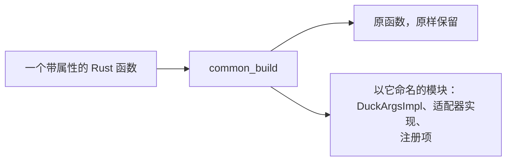
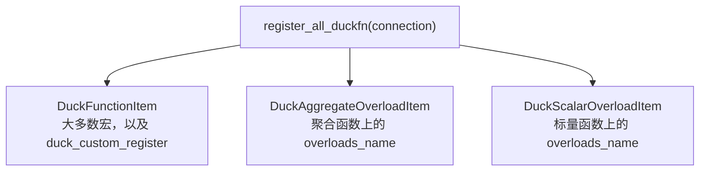
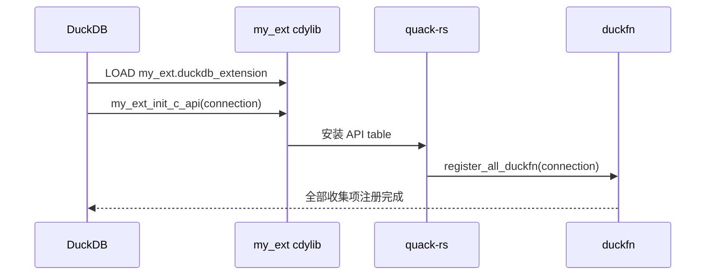
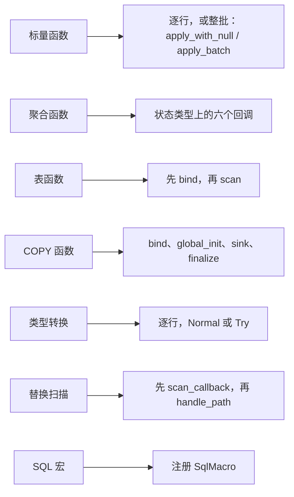

# 架构

本页沿着一个加了属性的函数，从源码一路看到它被注册进 DuckDB。

:::info[架构图与更细的讲解]
[Zread](https://zread.ai/shijianjs/duckfn) 用生成的架构图梳理了这个仓库 —— 模块分层、注册流程等等，
内容非常详细丰富。本页不够用的时候，从那里入手。
:::

## 组成

| Crate | 职责 |
| --- | --- |
| `duckfn-macro` | 过程宏。读取属性、校验签名，生成包装代码与注册项。 |
| `duckfn` | 运行时：适配器 trait、值类型、`inventory` 注册表、入口点胶水。 |
| `quack-rs` | DuckDB C API 绑定：各类 builder、`LogicalType`、`DataChunk`、`VectorReader`/`VectorWriter`、`SqlMacro`、`ExtensionError`。 |
| `libduckdb-sys` | DuckDB 的 C 头文件，以 `loadable-extension` feature 编译。 |

`duckfn` 的模块都是 `pub(crate)`，公共接口就是 `src/lib.rs` 里那些 `pub use` 重导出 ——
这也是为什么 `duckfn::DuckOptionResult` 存在，而 `duckfn::ExtensionError` 不存在。

## 1. 宏展开

属性宏走 `common_build`：保留原函数，并追加一个与函数同名的模块：

```
#item_fn                     // 原函数，原样保留
#vis mod #name {             // 可见性继承自函数
    use super::*;
    #[derive(duckfn::DuckStruct, Debug, Clone, Default)]
    #[duck(#attr)]           // 属性参数原样转写
    pub struct DuckArgsImpl { /* 每个参数一个字段 */ }
    // 各宏特有的 item：适配器实现与 builder
}
```



`DuckArgsImpl` 是参数列表与数据流向之间的桥梁：`#[derive(DuckStruct)]` 让它变成 `DuckColumns` 类型，
于是同一个结构体既用来从 DataChunk 读参数，也用来把结构体参数写回去。适配器实现随后调用原函数。
各宏生成的 item 清单见[属性参考](../guide/attributes.md)。

## 2. 注册

宏把注册项提交到 `inventory` 注册表，由链接期收集：

```rust
pub type DuckRegisterFn = fn(connection: &Connection) -> DuckResult<()>;

pub struct DuckFunctionItem {
    pub register_fn: DuckRegisterFn,
}

inventory::collect!(DuckFunctionItem);
```

三张注册表对应三种注册策略：

| 注册表 | 收集来源 | 由谁注册 |
| --- | --- | --- |
| `DuckFunctionItem` | 大多数宏，以及每个 `#[duck_custom_register]` 函数 | `register_all_duckfn` |
| `DuckAggregateOverloadItem` | 聚合函数上的 `overloads_name` | `register_all_aggregate_overload` |
| `DuckScalarOverloadItem` | 标量函数上的 `overloads_name` | `register_all_scalar_overload` |



`register_all_duckfn` 按上表顺序依次处理；重载那两遍用 `itertools::into_grouping_map_by` 按名字分组，
使共享同一个 `overloads_name` 的签名最终落进同一个函数集。注册表里的 `name` 字段用 `&'static str`
而不是 `String`，因为 `inventory::submit!` 展开成的是 `static` 初始化表达式，其中无法构造 `String`。

## 3. 入口点

```rust
duckfn_entrypoint!("my_ext");
```

展开为

```rust
quack_rs::entry_point_v2!(my_ext_init_c_api, duckfn::register_all_duckfn);
```

所以导出符号是 `{name}_init_c_api`，函数体就是用 DuckDB 交来的 `Connection` 调用 `register_all_duckfn`。
名称在编译期被校验：非空，且只含小写 ASCII 字母、数字与下划线。

## 4. 分发

开启 `loadable-extension` 后，DuckDB 的 API 函数不会被链接，而是经一张 `AtomicPtr` 表解析；
DuckDB 加载扩展、调用入口点时把这张表填好：



这就是不需要编译 DuckDB 的原因，也是扩展必须与编译时所用 DuckDB 版本绑定的原因。

## 5. 适配器

每种注册方式都有一个适配器 trait，负责把 Rust 值接到 DuckDB 基于 vector 的回调上。



### 标量函数

先把整个输入 chunk 读成一批行（`Vec<Option<Args>>`，`None` 表示该行整体为 `NULL`），把这批行交给
`apply_batch`，再批量写出结果。`apply_batch` 的默认实现遍历这批行、逐行调用 `apply_with_null`，
因此逐行语义不变：任一非 `Option` 参数为 `NULL` 时 `apply_with_null` 返回 `Ok(None)`，这就是整行短路的
来源。批量实现改为覆盖 `apply_batch`（`batch = true` 生成的就是它）：一次拿到整批行、返回
`Vec<Option<Output>>`，其中的 `Ok(None)` 表示整批 `NULL`，返回长度必须与批大小一致。

`null_handling()` 默认返回 `DefaultNullHandling`，`special_null_handling = true` 时被覆盖为
`SpecialNullHandling`。类似地，`volatile()` 默认返回 `false`，`volatile = true` 时被覆盖为 `true`，
注册期随之调用 `duckdb_scalar_function_set_volatile`（DuckDB 1.2.0 起的稳定 C API，`quack-rs`
逐重载暴露）。`varargs_element_type()` 默认返回
`None`；`varargs = true` 时返回签名最后一个 `Vec<T>` 的元素类型，注册期调用
`duckdb_scalar_function_set_varargs`（DuckDB 1.2.0 起的稳定 C API），回调则改走 `apply_varargs` 而不是 `apply`
（可变参数没有稳定的行结构，因此从不成批物化）。

### 聚合函数

DuckDB 的六个回调都实现在状态类型上：

| 回调 | 行为 |
| --- | --- |
| `c_state_size` / `c_state_init` | 分配并初始化状态（`Default`）。 |
| `c_update` | 读一行并调用 `handle_row_with_null`；默认跳过 `NULL` 行。 |
| `c_combine` | 把部分状态合并进另一个状态，供并行聚合使用。 |
| `c_finalize` | 对每个状态调用 `result()` 并写 vector；`offset` 非 0 会被拒绝。 |
| `c_state_destroy` | 释放状态。 |

聚合函数与函数集直接用 `quack-rs` 的 `AggregateFunctionBuilder` / `AggregateFunctionSetBuilder`，
不再自建 RAII 守卫与 duckfn 专属的函数集 builder：0.18 起每个 `AggregateOverloadBuilder` 各自带
`returns` / `returns_logical`，函数集 builder 不再强制整个函数集共用一个返回类型。

### 表函数

`bind_state` 是 bind 阶段：读取参数、通过 `config_result_columns` 决定输出列，并返回参数作为
bind data。`init_state` 每次执行从 bind data 重建行迭代器 —— 迭代器不是 `Clone`，因此用不了
`quack-rs` 的 `with_state`。`scan` 每个 chunk 从该迭代器拉一次数据。各阶段都包在 `catch_unwind` 里，
因此任一处 panic 都会变成查询错误。
迭代器类型是 `DuckFullIterator<T> = Box<dyn Iterator<Item = DuckOptionResult<T>> + Send>`。

### COPY 函数

`COPY ... TO` 与 `COPY ... FROM` 都建立在运行时动态列（`src/dynamic`）之上，而不是
`DuckValueType` —— 因为 COPY 函数的列要到 bind 阶段才知道。

`COPY ... TO` 由四个回调驱动：`bind` 把输出列逐列反推成 `DuckResultSchema`（每列一次
`DuckTypeDesc::from_logical_type`）并读出 COPY 选项，两者存成 bind data；`global_init` 调用
`DuckCopyToWriter::open(path, schema, options)` 并把 writer 存成 global state；`sink` 通过
`DuckDynamicRow::read_batch` 把每个数据块读成 `Vec<DuckDynamicRow>` 后调用被标注的函数；
`finalize` 调用 `DuckCopyToWriter::finish`。

`COPY ... FROM` 完全不是 COPY 的回调：它是一个普通的表函数，由它的 scan **产出**行。两端都走
quack-rs：`TableFunctionBuilder::build_handle` 建出**尚未注册**的 reader 表函数（顺带校验了「恰好一个
`VARCHAR` 位置参数」这条 DuckDB 自己从不检查的约束），`CopyFunctionBuilder::copy_from` 把它挂到格式
上，最后 `register` 注册。`bind` 解析 `Args`、用 `duckdb_table_function_bind_get_result_column_*` 读
**目标表**的 schema（COPY FROM 的 reader 不声明结果列）；`scan` 调用被标注的取批函数并用
`DuckDynamicRow::write_batch` 写出；reader 的 `finish` 由 init data 的析构回调触发 —— 表函数没有
finalize 回调。bind → init → scan 的状态传递仍复用 quack-rs 的 `FfiBindData` / `FfiInitData`。

bind data 与 global state 都用 `Box` 承载、配上负责 drop 的析构回调交给 DuckDB，每个回调都包在
`catch_unwind` 里，错误经 `set_error` 上报。这套 API 来自 DuckDB 1.5.0+，因此这些模块、适配层与
quack-rs 的再导出都在 `duckdb-1-5` feature 后面。

改这块代码时要记住两个所有权陷阱：`duckdb_table_function_bind_get_result_column_name` 返回的字符串、
以及 `duckdb_copy_function_bind_get_options` 返回的 value，都**由 DuckDB 持有**，不能释放（否则堆损坏
`0xC0000374`），适配层只借用它们。reader 表函数句柄由 quack-rs 的 `TableFunctionHandle` 持有、drop 时
销毁：DuckDB 在 `copy_from` 挂上去时是**拷贝**一份，所以交出之后释放我们这份是正确的。

### 类型转换

包装函数拿到 `count`、输入 vector 与输出 vector，逐行调用函数。出错时按转换路径处理：
`CastMode::Normal`（`CAST`）让整条查询失败，`CastMode::Try`（`TRY_CAST`）记录行级错误并写入 `NULL`。

### 替换扫描

`scan_callback` 收到未解析的表名。`handle_info` 调用用户的 `handle_path`，在 `Some(table_fn)` 时设置要转调的函数，
并把路径作为第一个 VARCHAR 参数传入。非 UTF-8 的名字会被跳过，`Err` 通过
`duckdb_replacement_scan_set_error` 上报。

### SQL 宏

最简单的适配器：返回 `SqlMacro` 就注册它，返回字符串就用 `duckdb_query` 执行 —— 这也是字符串里可以放多条语句的原因。

## 6. 值类型

`DuckValueType` 是让一个 Rust 类型可以作为参数或结果的 trait：

| 方向 | 方法 |
| --- | --- |
| 类型标识 | `type_id()`、`logical_type()`、`from_null()` |
| 读取 | `create_reader`、`read_valid`、`read_slot`、`read_by_duck_value*` |
| 写入 | `write_batch`、`write_valid`、`write_null`、`write_finish` |

实现者只需重写 `*_valid` 那一半；`read` 与 `write` 不建议重写。`DuckValueReader` 与 `DuckValueWriter`
携带 vector 及其子 reader/writer，嵌套类型正是靠这一点递归进 LIST、MAP、ARRAY、STRUCT 的子节点。
`#[derive(DuckStruct)]` 还会为每个字段生成 `assert_impl_duck_value_type::<T>()` 调用，
因此不支持的字段类型是编译错误，而不是运行时的意外。

可空性是「类型」的属性，而不是容器的：`Option<T>` 实现了 `DuckValueType`，逻辑类型与 `T` 相同，
并把 `from_null()` 覆写成 `Some(None)`，其余类型保持默认的 `None`。元素、map 键值、结构体字段
统一走 `read_slot()`，由它接上这个回退 —— 正因如此 `Vec<T>` / `[T; N]` / `IndexMap<K, V>`
各自只需一份实现就能同时服务可空与不可空的元素类型，`#[derive(DuckStruct)]` 也不必再按语法去
识别字段类型。

`DuckValueReader` 还带一个存活凭证（`Arc<ChunkToken>`，通过 `alive_weak()` 暴露成 `Weak`），
`DuckLazy<T>` 正是靠它把读取推迟：拿到 reader 就等于拿到「这块向量此刻有效」的证明，于是延迟值能区分
「还在回调里」与「chunk 已经没了」，后者给出报错而不是解引用一块失效的向量。`DuckLazySlot<T>` 是这套
设计的使用端：它把延迟值解析一次、留在聚合状态里，`combine` 时搬运解析结果、`result()` 里取回 ——
凭证本身始终不出回调。

`DuckStructTrait` 是生成的结构体接口，三个 blanket impl 把它接入系统其余部分：`DuckValueType`（可作为值）、
`DuckColumns`（可作为表函数的输出行）、`DuckBindArgs`（可作为表函数的参数）。

## 去哪里看代码

| 问题 | 文件 |
| --- | --- |
| 属性接受哪些参数？ | 该宏自己的文件，如 `duckfn-macro/src/scalar_function.rs` |
| 宏生成了什么？ | 同一个文件加上公共的 `common.rs`；derive 在 `duck_struct_derive.rs` / `duck_enum_derive.rs` |
| 入口点怎么生成？ | `duckfn-macro/src/entrypoint.rs` |
| 注册是怎么工作的？ | `src/register.rs` |
| 回调是怎么实现的？ | `src/functions/*_adapter.rs` |
| 类型是怎么转换的？ | `src/value_types/*.rs` |

## 接下来

- [属性参考](../guide/attributes.md) —— 宏展开在用户侧的样子。
- [贡献指南](./contributing.md) —— 在这些 crate 上开发。
