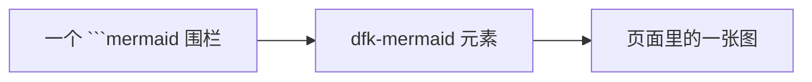
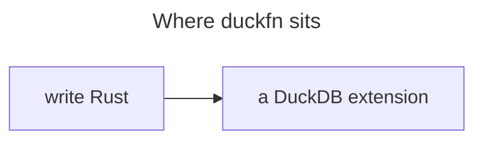

# Mermaid 图

一个 ```` ```mermaid ```` 围栏会成为一张图，由 kit 的 `<dfk-mermaid>` 元素在浏览器里渲染：



## 接入

只在 docs preset 的 `remarkPlugins` 里加一项，别的什么都不用：

```ts
import {remarkMermaid} from 'duckfn-docs-kit/mermaid/remark';

export default {
  presets: [
    [
      'classic',
      {
        docs: {
          remarkPlugins: [remarkMermaid],
        },
      },
    ],
  ],
};
```

**不要安装 `@docusaurus/theme-mermaid`**，不要把它写进 `themes`，也不要打开
`markdown.mermaid`。kit 的元素把这三件事都接管了；主题留在那儿就等于在同一个围栏上放两个渲染器。

## 为什么改由 kit 渲染

上游主题组件的两个缺陷是**结构性**的，既改不了 `docusaurus.config.ts`，也改不了图源：

- **暗色首屏会闪。** 主题用 `useColorMode()` 取配色，而它的值在客户端首帧**故意滞后**，于是暗色
  页面会先画一张*亮色*的图、紧接着再画一张暗色的。这两份还会在 mermaid 的可变单例里重叠，偶尔
  解析出一张空图且不报错。
- **两张图不能同时画** —— mermaid 就是一个可变单例。

元素改从 `<html data-theme>`（首帧之前就写好的属性）读配色，并让所有图走同一条页面级队列，
所以每张图在每个模式下只渲染一次，且用的是页面真实的模式。

## 配色

默认是 `neo` 外观配 redux 调色板 —— 亮色 `redux-color`、暗色 `redux-dark-color`。站点在自己的
配置里覆盖：

```ts
remarkMermaid({
  config: {theme: {light: 'neutral', dark: 'dark'}, options: {look: 'classic'}},
});
```

`theme` 按颜色模式各一项；`look` 没有明暗之分，走 `options`。mermaid 对不认识的取值会**静默忽略**
并回退——所以要在浏览器里看图，而不是看构建结果。（`node` 元素上带着 `data-look`，是确认外观是否
生效的最快办法。）

## 读者能用的东西

鼠标悬停在图上，右上角会出现它的按钮：

| 按钮 | 作用 |
| --- | --- |
| 还原缩放 | 回到适应大小。图真的能缩放之后（也就是全屏里）才出现。 |
| 全屏 | 铺满视口**并打开缩放**，按 <kbd>Esc</kbd> 退出。 |
| 编辑源码 | 在 CodeMirror 对话框里打开 mermaid 源码，「应用」后重新渲染；改动只作用于当前页面。 |
| 下载 SVG | 把图存成 `.svg`，文件名取自它所在的章节。 |

**页面上的图是一张图片；全屏才把它变成一个视口。** 行内时滚轮在它上面滚的是页面，光标就是
普通光标（在文字上是 I 型），拖拽即选文字，所以标签可以像页面上的其它文字一样复制。展开之后
这些全都变了：指针变成抓取手型，拖拽即平移（不必先放大——比屏幕高的图可以直接拖遍），滚轮
进出都能缩放，所以铺满屏幕的图也缩得小。变成视口期间**故意不能再选文字**：拖拽本来就会平移，
再让它去选字只会让手势含混。没有需要记住的「选择 / 拖拽」模式——全屏本身就是那个模式。点
「还原缩放」可以让图在不退出全屏的情况下回到适应大小，一旦退出全屏就全都回到行内的行为。

**下载的文件名来自页面**，而不是 `mermaid-diagram.svg`——取的是它所在的章节（如
`2. Registration.svg`）。名称按下面的顺序取第一个有内容的：图自己的标题（mermaid frontmatter，
`---\ntitle: …\n---`）→ 它上方最近的标题 → 页面标题 → `mermaid-diagram.svg`。如果标题不是你想要的
名字，就给围栏加个 frontmatter：

````md

````

## 注意

- **图是在客户端渲染的**，所以语法错误会出现在页面里（带 mermaid 自己的报错信息），而不是让构建失败。
- 标签请加引号（`A["text"]`），换行用 `<br/>`，避免裸 `#` 和未转义的 `&`。
- **更长的围栏里**嵌套的 ```` ```mermaid ````（比如本页这样用它做说明）仍是文本，不会变成图。
- 可运行 SQL 块也能产出图：`"show": "mermaid"` 把结果里的那一列交给同一个元素——它以嵌入
  方式放进结果面板，因此外框与悬浮按钮组都不出现，**还原缩放** / **编辑源码**改为并入页签
  栏，见 [可运行 SQL 块](./runnable-sql.md)。