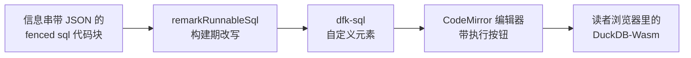

# 可运行 SQL 块

信息串里带 JSON 配置的 SQL 代码块会变成可运行示例：代码块本身就是 CodeMirror 编辑器，
不点 **执行** 不会有任何查询跑起来。悬停或聚焦时，代码块右上角出现一排按钮（执行、全部执行、
格式化、重置、折行、复制）；**格式化** 只重新排版空白、保留你写的关键字大小写。查询在浏览器里
对着一个全局共享的 DuckDB-Wasm 实例执行，结果显示在代码块下方。

**全部执行** 会把当前页面上的可运行块按页面顺序逐个跑一遍——一页里堆了一串画图的块时，
就不必一个个点 **执行** 了。

只要页面上有可运行块，DuckDB 就在页面打开时开始后台初始化，所以第一次点 **执行** 不用等下载。

编辑器和结果表格是一个块里最重的两块，而且各自是独立的 chunk。CodeMirror 到位之前，代码区按
SQL 的行数一行一条地显示占位；VTable 加载期间，表格结果先显示两行占位。两者都按它们要顶替的
东西的尺寸来画，所以替换本身不会改变高度——唯一例外是长到会在编辑器里折行的 SQL 行，占位预判
不了它。

配置是 JSON（不是 `key=value`），以后可以继续加嵌套字段：

````md
```sql {"type":"duckfn","show":"table"}
SELECT * FROM range(10);
```
````

构建期它会先走一段很短的流水线，才到读者手里：



## `.md` 与 `.mdx` 表现一致

可运行块不依赖任何 MDX 特性：JSON 信息串由 `remarkRunnableSql` remark 插件在构建期读取，
把代码块改写成 `<dfk-sql>` 自定义元素，这一切发生在文件被编译之前——所以普通 `.md` 页面
与 `.mdx` 完全一致，本页就是 `.md`：

```sql {"type":"duckfn"}
SELECT 40 + 2 AS answer;
```

## 最小示例

`show` 可以省略；单列单行的结果会以 `Text` 页签打开，而不是表格。

```sql {"type":"duckfn"}
SELECT 1;
```

## 一个普通查询

```sql {"type":"duckfn","show":"table"}
SELECT *
FROM range(10)
WHERE range > 5;
```

## 多条语句

块里有多条语句时，显示的是**最后一条**的结果——适合先来一段 `SET` / `CREATE` 铺垫，
再跟真正想看的查询。但这是给前置语句用的，不要把多个独立示例堆在一个块里：除最后一条之外的结果
都看不到，一个示例一个块。

```sql {"type":"duckfn","show":"table"}
CREATE TABLE t AS SELECT * FROM range(5) r(i);
SELECT i * 10 AS ten FROM t ORDER BY i DESC;
```

## 错误会留在原地

执行失败的语句会把错误渲染在结果区；编辑器里写的内容保持不动，什么都不会重置。

```sql {"type":"duckfn","show":"table","expect":"error"}
-- 故意报错：这个块声明了 "expect": "error"
SELECT this_function_does_not_exist(1);
```

## HTML 报告（`show: "html"` / `show: "iframe"`）

`html` 与 `iframe` 是同一个渲染器：标记被放进 iframe 的 `srcdoc`，每行一个页签，原始数据
保留在恒定排在**最后**的 `Table` 页签里。`field` 指定放着标记的列（单列结果无需指定），
`tab_name` 指定用来标注每个页签的列。

iframe 的 sandbox 是 `allow-scripts` 且**不含** `allow-same-origin`：报告里的 JavaScript
照常运行，而 frame 持有 opaque origin，与文档站主体隔离。正因如此，HTML 报告——包括图表
——才能在这里跑起来；要放宽就显式写 `option.sandbox`。

```sql {"type":"duckfn","show":"iframe","field":"html","tab_name":"label","option":{"height":"170px"}}
SELECT * FROM (VALUES
  ('Bars', '<!doctype html><meta charset="utf-8"><body style="font:14px system-ui;margin:0;padding:12px"><h4 style="margin:0 0 8px">Quarterly revenue</h4><svg viewBox="0 0 240 80" width="240" height="80"><rect x="0" y="20" width="60" height="60" fill="#14459b"/><rect x="80" y="40" width="60" height="40" fill="#3d7bd6"/><rect x="160" y="10" width="60" height="70" fill="#8ab4f8"/></svg></body>'),
  ('Script', '<!doctype html><meta charset="utf-8"><body style="font:14px system-ui;margin:0;padding:12px"><h4 style="margin:0 0 8px">Scripts run</h4><p id="out"></p><script>document.getElementById("out").textContent = "this frame ran JavaScript, with an opaque origin";</script></body>')
) AS t(label, html);
```

## 内联 SVG（`show: "svg"`）

`svg` 把标记直接拼进页面而不是框起来——面板同样是每行一个页签，外加末尾的表格。因为内联
SVG 与页面共享同一个文档，所有可能执行或导航的内容（script、`foreignObject`、`on*` 处理
器、`javascript:` 链接）都会在插入前被剥掉。这张图的行为与图表一致：缩放与拖拽在全屏里才
打开，**编辑源码**会弹出对话框，改完应用即重新渲染。

**比正文栏更宽的图会被缩到栏宽，面板高度按图形比例跟着长**；本来就装得下的图保持原始大小，
不会被放大。这依赖标记里带 `viewBox`——SVG 能缩放全靠它；只写了 `width` 和 `height` 的根
节点（多数绘图库的输出就是这样）会在插入前补上 `viewBox="0 0 <width> <height>"`。没有
`viewBox` 时，盒子无论被改多窄，画的内容都按自己的尺寸来，右侧那一块会被直接裁掉。
`width="100%"` 推不出坐标系，保持原样。

```sql {"type":"duckfn","show":"svg","option":{"height":"140px"}}
SELECT '<svg xmlns="http://www.w3.org/2000/svg" viewBox="0 0 260 100" width="260" height="100"><circle cx="50" cy="50" r="40" fill="#14459b"/><circle cx="120" cy="50" r="30" fill="#3d7bd6"/><text x="170" y="56" font-family="system-ui" font-size="16" fill="#181818">from SVG</text></svg>';
```

## Mermaid 图（`show: "mermaid"`）

`mermaid` 把该列的源码渲染成图，用的正是 ```` ```mermaid ```` 围栏产出的同一个
`<dfk-mermaid>` 元素——所以一条查询也能画出图，而且读者顺带得到该元素的缩放、改源码与
下载 SVG。以这种嵌入方式使用时，元素既不自己画外框、也不浮出按钮组：结果区已经把这两样
都画好了，所以**还原缩放**与**编辑源码**移到页签栏，图则在结果区的全屏里缩放。与其它预览
一样：每行一个页签，原始数据留在末尾的 `Table` 页签里。

```sql {"type":"duckfn","show":"mermaid"}
SELECT 'flowchart LR' || chr(10)
  || '  A["一条 SELECT"] --> B["一个结果单元格"]' || chr(10)
  || '  B --> C["一张图"]' AS diagram;
```

## 加载扩展

本站文档化的扩展在每一页预加载，所以这里的示例直接调用即可——预加载列表见
[扩展预加载](./preloaded-extensions.md)。块内也可以按需加载：`extensions` 列出执行前要
`LOAD` 的扩展，`repository` 指向别的来源——`community`、`core` 或仓库 URL。两者都是块级
配置，而“已加载集合”由页面上所有块共享。

```sql {"type":"duckfn","show":"table","extensions":["inet"]}
-- Cast to VARCHAR: the wasm bridge hands INET to the page as a struct.
SELECT '127.0.0.1'::INET::VARCHAR AS ip, '10.0.0.0/8'::INET::VARCHAR AS network;
```

签名校验不过的扩展会被拒绝，除非打开 `allowUnsignedExtensions`——第三方 release 资产没有
用 DuckDB 的密钥签名——由**最先**初始化共享运行时的那个块决定整个实例。

## 页签右侧的控制条

每个结果都带同一条页签栏——普通表格结果也有——它的右端承载整个结果共用的控制：**当前页签
自己的按钮**、**下载**按钮，以及全屏开关。页签自己的按钮随页签出现与消失：

| 页签 | 控制 |
| --- | --- |
| `Table` | 搜索、复制整表、列宽模式、重置视图、取消冻结 |
| `svg` / `mermaid` | 还原缩放、编辑源码 |
| `html` / `iframe` / `text` | 无 |

表格这些按钮就是它右键菜单里「整表」的那一半，放在压不到单元格的地方；右键菜单本身仍保留
按单元格的项（复制此单元格、此行/列折行、冻结到此列）。**取消冻结**只在真的冻结过列之后
才出现——从菜单的冻结项进入该状态——没有冻结列时它又会消失。

**下载**保存当前页签显示的内容，格式随页签而定：表格是 `.csv`，图是 `.svg`，准备好的
frame 是 `.html`，文本是 `.txt`。只有在还无可保存内容时（例如图尚未渲染完）才会隐藏。

全屏开关在最末端。点击后结果铺满视口，同一个按钮（此时是*退出全屏*）留在原位；按
<kbd>Esc</kbd> 也能退出。全屏也是图唯一能缩放拖拽的地方——指针在那儿的行为见
[Mermaid 图](./mermaid.md)。

```sql {"type":"duckfn","show":"table"}
SELECT i AS n, repeat('wide column ', 3) AS filler
FROM range(40) t(i);
```

## 搜索表格

表格结果与页面同宽，所以搜索框开在**页签栏里**，而不是浮在它要找的那些单元格上方。输入会
高亮所有命中，计数器（`3/12`）说明当前位置；箭头在命中之间跳转，最后一个按钮清空输入。
搜索是按表格结果独立的，换一个结果就从头开始。

```sql {"type":"duckfn","show":"table"}
SELECT i AS n, 'row ' || i AS label, i % 3 AS bucket
FROM range(20) t(i);
```

## 配置参考

| 字段 | 含义 |
| --- | --- |
| `type` | `"duckfn"`——标记该块可运行。必填。 |
| `show` | `table`（默认）、`text`、`html`、`iframe`、`svg`、`mermaid`。 |
| `expect` | `ok`（默认）或 `error`——文档站的 [SQL 测试](./sql-test.md) 对本块的要求；`error` 表示这是一个演示失败的块。 |
| `field` | 放着标记的列，用于 `html` / `iframe` / `svg` / `mermaid`。 |
| `tab_name` | 标注每个预览页签的列。 |
| `option.width` · `option.height` | 预览框的 CSS 长度。 |
| `option.sandbox` | iframe 的 sandbox tokens，替换默认的 `allow-scripts`。 |
| `extensions` | 执行前要 `LOAD` 的扩展名，在站点级预加载之外追加。 |
| `repository` | 这些扩展的来源：`community`、`core` 或仓库 URL。 |
| `allowUnsignedExtensions` | 接受无法验证的签名（站点级经预加载配置，或块级；最先初始化的块定调）。 |

## 普通代码块不受影响

只有信息串能被解析为带 `"type":"duckfn"` 的 JSON 的块才会变成可运行块。普通 SQL 代码块
照常渲染成普通代码块：

```sql
SELECT 'just documentation, no run button';
```
