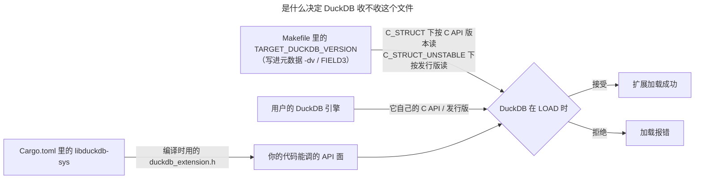

# DuckDB 版本兼容性

duckfn 扩展从不链接 DuckDB：它走 C API 的函数表调用，而「这个文件收不收」是 DuckDB 在 `LOAD`
时自己判定的。这个判定里涉及三个不同的数字，而人们平常说的「DuckDB 版本」只是其中一个。你在每一处
各取什么立场，决定了一份产物是服务一串 DuckDB 发行版、还是只服务其中恰好一个。

`wasm_*` 产物的**构建工具链** —— 必须对齐的 Rust、emsdk/binaryen 与 ci-tools 版本 —— 是另一套独立的、
更绕的故事，见 [wasm 构建工具链](./wasm-toolchain.md)，与之并列的还有
[WebAssembly 上的 Rust 展开](./rust-wasm-unwinding.md)。

## 三个数字



| 数字 | 在哪里设定 | 含义 |
| --- | --- | --- |
| **头文件来自哪个发行版** | `Cargo.toml` 里的 `libduckdb-sys`（在 `Cargo.lock` 里解析定版） | 构建对着哪一份 `duckdb_extension.h` 编译 —— 你的代码能调用的 API 面。 |
| **写进元数据的那个值** | `Makefile` 里的 `TARGET_DUCKDB_VERSION`，作为 `-dv` 交给 `append_extension_metadata.py` | `abi_type = C_STRUCT` 下读作 **C API 版本**；`C_STRUCT_UNSTABLE` 下读作 **发行版本号**。 |
| **加载这个文件的引擎** | 用户的 DuckDB | 它自己的 C API 层级（或发行版），就是拿去比对这条声明的东西。 |

工作流里的 `duckdb_version`（以及它顺带导出的 `DUCKDB_VERSION`）是第四个、与此无关的旋钮：它决定分发
流水线 checkout 哪份 DuckDB 源码、sqllogictest 用哪个引擎、产物怎么命名。它永远到不了你的扩展。

## `C_STRUCT` vs `C_STRUCT_UNSTABLE`

`Makefile` 里的 `USE_UNSTABLE_C_API` 决定元数据声称哪种 ABI 类型，而**正是它**让 `-dv` 那个值有两种含义。

**`USE_UNSTABLE_C_API=0` → `abi_type = C_STRUCT`。** 这条声明是一个**下限**，加载器比对 C API 版本：

```text
The file was built for DuckDB C API version '<declared>', but we can only load extensions built for
DuckDB C API '<engine>' and lower.
```

C API 不低于你这条下限的引擎都会收下这个文件；它具体的发行版本号无所谓。这就是你要的可移植性，只要代码
待在 C API 的稳定区，它一分钱不花。

**`USE_UNSTABLE_C_API=1` → `abi_type = C_STRUCT_UNSTABLE`。** 这时声明是一个**发行版**，引擎要求逐字相等。
扩展 API 的不稳定区是按槽位寻址的 C 结构体，对着不同槽位集合编译的构建根本跑不了：一个文件，一个引擎。

`append_extension_metadata.py` 自己的帮助文本讲了这个分界：*"The DuckDB version to encode, depending on
the ABI type this encodes the duckdb version or the C API version."*

## 这些值从哪来

设置分散在两个文件 —— 头文件来自 `Cargo.toml`，声明来自 `Makefile`：

```toml
# Cargo.toml — 头文件
libduckdb-sys = { version = ">=1.10500, <2", features = ["loadable-extension"] }
```

`libduckdb-sys` 把 DuckDB 发行版编码成 `1.<major*10000 + minor*100 + patch>.0`，所以 `1.10506.0` 是
DuckDB 1.5.6，上面那个 `>=1.10500` 就是「DuckDB 1.5 头文件或更新」。

没有别的东西会改写 `Makefile` 那一行：ci-tools 的 `set_duckdb_version` 对 C API 扩展是 no-op，社区
registry 的 `duckdb_version` 只决定 checkout 哪份 DuckDB 源码、产物怎么命名、部署进哪个版本目录。它归你
维护 —— 见[构建与发版](../development/build-and-release.md)。下一节给出两边的完整配置集。

## 给自己扩展做选择

一个问题决定一切：**你的代码碰不稳定区吗？**

- 稳定区之外的是：copy 函数、宿主文件系统（`duckfn::duck_vfs`）、标量的 `bind` / `init` 槽位、`varargs`，
  以及 DuckDB 1.5 新增的逻辑类型（目前是 `TIME_NS`）。duckfn 把这些统一收在 `duckdb-1-5` feature 后面；
  `owned-connection`（宿主 VFS）蕴含它。
- 其余都在稳定区：标量、聚合、表函数、cast、replacement scan、SQL 宏、命名的 STRUCT / ENUM 类型，
  以及 chrono / uuid / rust_decimal 桥。

### 稳定区 —— 完整配置集

```make
# Makefile
EXTENSION_NAME=my_extension
USE_UNSTABLE_C_API=0
TARGET_DUCKDB_VERSION=v1.2.0
```

```toml
# Cargo.toml —— ABI 要点是 `duckdb-1-5` 保持关闭（`cli` 只为 function_descriptions bin，与 ABI 无关）。
duckfn = { version = "{{DUCKFN_VERSION}}", features = ["cli"] }
```

```yaml
# .github/workflows/MainDistributionPipeline.yml
      duckdb_version: v1.5.6     # 任何不低于下限的引擎都行；选最新的更稳
```

- `TARGET_DUCKDB_VERSION` 是 **C API 下限**，不是发行版 —— 这就是该模式买到的东西。`v1.2.0` 是 DuckDB
  1.3.2 到 1.5.5 共同停留的层级，所以一份产物通吃（实测见下）。
- **这里刻意没有 `export QUACK_RS_TARGET_DUCKDB_VERSION`，加了也没用。** quack-rs 只在不稳定路径读那个变量：
  只要 `uses_unstable_api()`（即 `cfg!(feature = "duckdb-1-5")`）为假，`abi::check()` 在调用
  `built_against_version()` 之前就返回 `StableOnly`。
- 也没有 `DUCKDB_TEST_VERSION`，同理：测试 runner 可以是任意更新的引擎，因为每个不低于下限的引擎都收这份产物。

### 不稳定区 —— 完整配置集

```make
# Makefile
EXTENSION_NAME=my_extension
USE_UNSTABLE_C_API=1
TARGET_DUCKDB_VERSION=v1.5.6
export QUACK_RS_TARGET_DUCKDB_VERSION=$(TARGET_DUCKDB_VERSION)
DUCKDB_TEST_VERSION := $(patsubst v%,%,$(TARGET_DUCKDB_VERSION))
```

```toml
# Cargo.toml
duckfn = { version = "{{DUCKFN_VERSION}}", features = ["duckdb-1-5"] }   # + "owned-connection" 用于 duckfn::duck_vfs
```

```yaml
# .github/workflows/MainDistributionPipeline.yml
      duckdb_version: v1.5.6     # 必须等于 TARGET_DUCKDB_VERSION；它是 `make test` 载入进去的那个引擎
```

- **`export` 关键字是这一行的一部分，不是装饰。** quack-rs 的 build script 从*环境*里读
  `QUACK_RS_TARGET_DUCKDB_VERSION`，而 `make` 除非标了 `export` 否则不会把变量放进环境。去掉 `export`，
  cargo 什么也看不到 —— 不报错，只是个空值，于是那个布局检查回退到 quack-rs 自己的表，而那正是引擎是
  quack-rs 还没收录的发行版时把它拒掉的东西。
- 在这个模式下 `TARGET_DUCKDB_VERSION` 是一个**发行版**，引擎必须逐字匹配 —— 这就是为什么测试 runner 的
  钉版（`DUCKDB_TEST_VERSION`）和 CI 的钉版要跟它一起动。
- 退回稳定侧要一次性删掉这三行带版本味的配置：`export`、`DUCKDB_TEST_VERSION` 的派生，以及 CI 那条
  「必须相等」的要求。

两种模式都躲不掉的一个坑：

- **别在声明 `C_STRUCT` 的同时打开 `duckdb-1-5`。** 加载器只校验你声明了什么，于是不稳定区槽位对不上的
  引擎照样会收下这个文件 —— 而对不上暴露出来的不是加载错误，是未定义行为。两边选一边，别跨着站。

### 稳定区的一份产物到底覆盖到哪

`v1.2.0` 是 DuckDB 1.3.2 到 1.5.5 共同停留的 C API 层级，所以一份声明它的稳定区产物在这一整段里都能被
收下。下面是用**同一份产物**实测的，每个引擎都加载成功并跑通了一次真实调用：

| 声明的 C API 下限 | 收下同一个二进制的引擎 |
| --- | --- |
| `v1.2.0` | 1.3.2、1.4.0、1.4.5、1.5.0、1.5.5、1.5.6、2.0.0（预发布） |

DuckDB 2.0 已经很近了（见它的 release calendar），而一份声明 `v1.2.0` 的稳定区产物在 2.0 上已经能加载
并跑通 —— 把这样的扩展装进一个 2.0 预发布、调用它的函数（一个聚合、一个标量都返回预期值）实测过。买到
这份可移植性的是那个「下限」：别把「能跑在 2.0 上」当成「是对着 2.0 编的」。

关于 2.0 有个命名坑：DuckDB 新出了**第二套 v2 C API**（`duckdb_v2.h`）—— 一套真正不同、仍在快速演进的
接口，由实验性的 `duckdb-neo` wrapper 使用。它**并不取代扩展所走的 v1 API**：可加载扩展构建在 v1 C API 上
（`libduckdb-sys` 默认的 `capi-v1` feature，`loadable-extension` 必需），而 2.0 照样加载的正是这套 v1。所以
「v2 C API 不一样」讲的是**那个新头文件**，不是 v1 扩展失去兼容。版本编码也要留意：DuckDB 2.0.0 映射成
`libduckdb-sys` 的 crate 版本 `1.20000.x`（格式 `1.<major*10000 + minor*100 + patch>.x`）—— 仍是 `1.x`，
所以 `>=1.10500, <2` 的约束会选中它。`<2` 不是拦路虎；把发布线切到 2.0 的真正闸门是它是否**正式发布**
（稳定的 `v2.0-cyanoptera` ci-tools ref 与真实的 `duckdb-shared-libs` 资产），不是某个 crate 版本上限。

只有确实需要更新的头文件时才抬高这个下限。抬的时候填的是 **C API 版本**、不是发行版本号：在那里写
`v1.5.6` 就只剩那一个引擎肯收了。

## 自己验证一个构建

`make debug` 会把刚写进产物的元数据打出来，这是看清「你实际声明了什么」而不是「你想声明什么」最快的
办法：

```text
FIELD2 = windows_amd64
FIELD3 = v1.2.0          # 声明的版本
FIELD5 = C_STRUCT        # ABI 类型
```

然后拿这**同一份**产物去喂几个引擎 —— 本地构建的产物一律要 `-unsigned`：

```shell
duckdb -unsigned -c "LOAD '<path>/my_extension.duckdb_extension'; SELECT my_greet('world');"
```

这里会冒出两个坑：

- **钉死的测试 runner 不等于被测引擎。** `make configure` 只建一次 `configure/venv`，从不刷新里面的
  Python `duckdb`（recipe 挂在目录上，第二次 `make` 会跳过它），于是一个过旧的 runner 会拒绝刚构建的
  扩展。就地升级它 —— 下面两条正是 `base.Makefile` 自己用的路径：

```shell
configure/venv/Scripts/python.exe -m pip install --upgrade "duckdb==1.5.6"   # Windows
configure/venv/bin/python3       -m pip install --upgrade "duckdb==1.5.6"   # Linux / macOS
```

- **头文件的钉版与引擎是两码事。** 更新 `libduckdb-sys` 改的是「你能调用什么」，不是「谁会加载你」；
  反过来也一样。

## WebAssembly（加载侧）

规则完全一样，只多一条：引擎是固定在 DuckDB-Wasm 构建里的，`LOAD` 时挑不了。所以不稳定区的产物必须由
带对应发行版的那个确切 dev 构建来服务，而稳定区的产物只要求引擎不低于它的下限。本站在哪里钉这个构建，
见[预加载扩展](../docs-kit/preloaded-extensions.md)。

`wasm_*` 产物怎么被**构建**出来 —— CI 装的 Rust、钉死的 emsdk/binaryen、以及它们来自哪个 ci-tools ref ——
是另一套版本故事，见 [wasm 构建工具链](./wasm-toolchain.md)。

## Release 资产 vs 社区仓

`LOAD '<release 资产的 url>'` 取回的正是你点名的那个文件，所以「一份产物通吃」完全是你那条声明的功劳。
社区仓走的是另一条路：它按**客户端上报的** DuckDB 版本发放对应的构建，目录树由 registry 自己填 —— 见
[社区扩展文档页](../community-extension-docs.md)。那条路因此是「按版本分派」，不是「跨版本容错」，无论你
声明了什么。

## 另见

- [wasm 构建工具链](./wasm-toolchain.md) —— `wasm_*` 背后 Rust / emsdk / ci-tools 的版本耦合。
- [WebAssembly 上的 Rust 展开](./rust-wasm-unwinding.md) —— `panic!` 为什么随 Rust 版本表现不同。
- [安装](../getting-started/installation.md) —— duckfn 每个 feature 各自对 DuckDB 提什么要求。
- [文件系统](../guide/file-system.md) 与 [COPY 函数](../guide/copy-functions.md) —— 住在不稳定区的两项能力。
- [构建与发版](../development/build-and-release.md) —— 两条构建路径与发版流程。
- [已知问题](../known-issues.md) —— 与版本无关的上游 bug。
