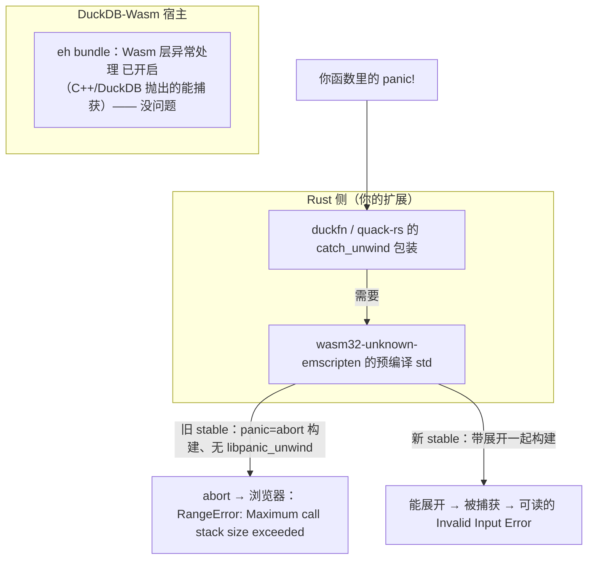

# wasm 下的 panic 处理

duckfn 与 quack-rs 把每个回调都包在 `std::panic::catch_unwind` 里，于是你函数里的 `panic!` 会变成一条可读
的 DuckDB 错误、而不是把进程搞崩。但这张安全网在 WebAssembly 上到底是不是「真的」，取决于 `rustc` 版本。
这就是实测经过。

## 两层



宿主那层（wasm 层 EH）一直都在 —— 开 `wasm_eh` 或 `emcc -fwasm-exceptions` **不是**解药，也救不回一个已被
Rust 编成 `abort` 的 `panic!`。从来缺的都是 *Rust 自己的*展开运行时，它住在这个 target 的预编译 `std` 里。

## 探针实验

加了两个一次性标量函数，构建 wasm 扩展，通过文档 harness（`just test_wasm` → Playwright →
`@duckdb/duckdb-wasm 1.33.1-dev65.0`，约 emsdk 3.1.71）在浏览器里跑同一条查询。只换 `rustc`
（`rust-toolchain.toml` / `RUSTUP_TOOLCHAIN`），emsdk 保持不变：

```rust
#[duck_scalar_function(/* … */)]
fn sr_probe_panic(_x: f64) -> DuckOptionResult<f64> {
    panic!("PROBE_PANIC_MARKER");            // 依赖 duckfn 自己的 catch_unwind
}

#[duck_scalar_function(/* … */)]
fn sr_probe_catch(_x: f64) -> DuckOptionResult<f64> {
    match std::panic::catch_unwind(|| panic!("PROBE_INNER")) {
        Ok(_)  => Ok(Some(0.0)),
        Err(_) => Err(duck_error("PROBE_CAUGHT_UNWIND_OK")),  // 自己接
    }
}
```

| stable rustc | 裸 `panic!` | `catch_unwind` |
| --- | --- | --- |
| **1.89** | `RangeError: Maximum call stack size exceeded`（abort） | **接不住** —— 没有可展开的东西 |
| **1.97.1** | `Invalid Input Error: PROBE_PANIC_MARKER` | **能接住** —— 返回 `PROBE_CAUGHT_UNWIND_OK` |

1.89 下两个探针都回那个栈溢出 `RangeError`；1.97.1 下裸 `panic!` 呈现为干净的 `Invalid Input Error:
PROBE_PANIC_MARKER`（框架的 catch_unwind 接住了），自写的 catch_unwind 返回了它的 marker —— 展开确实存在。

## 为什么版本有关

rustup 给 `wasm32-unknown-emscripten` 的预编译 `std` 曾是 `panic = "abort"` 构建、不含 `libpanic_unwind`，
所以没有展开运行时可跑，每个 `panic!` 都 abort。**较新的 stable** 现在把该 target 的 `std` 连展开一起发，
于是 `catch_unwind` 在浏览器里也生效。这消掉了过去 `RUSTFLAGS="-Cpanic=unwind" cargo +nightly build
-Zbuild-std=std,panic_unwind …`（nightly 重编 `std`）的需要 —— 当前 stable 就够。

## 该怎么做

- **无论工具链如何，首选可恢复路径。** 凡是调用方能响应的情形，返回 `Err(duck_error("..."))` /
  `DuckOptionResult` —— 它根本不展开，在原生与 wasm 上都是干净的 `Invalid Input Error`。
- `panic!` 只留给「必须中断进程的真·内部 bug」。在 wasm 上，除非你在足够新的 stable 上，否则它只会读成
  一个栈溢出；别指望它给用户报错。
- 若你确实需要 `catch_unwind` 在 wasm 上真触发（比如让一个 `panic!`-密集的依赖别把整次调用带崩），在
  [rust-toolchain.toml](./wasm-toolchain.md) 里钉一个较新的 stable —— 就是修 wasm 编译 MSRV 的那个文件 ——
  并保留 `-O0` 链接覆盖。

## 另见

- [wasm 构建工具链](./wasm-toolchain.md) —— Rust / emsdk / ci-tools 的版本耦合。
- [DuckDB 版本兼容性](./index.md) —— 产物面向哪个 DuckDB。
- [已知问题](../known-issues.md) —— 其余与版本无关的上游 bug。
