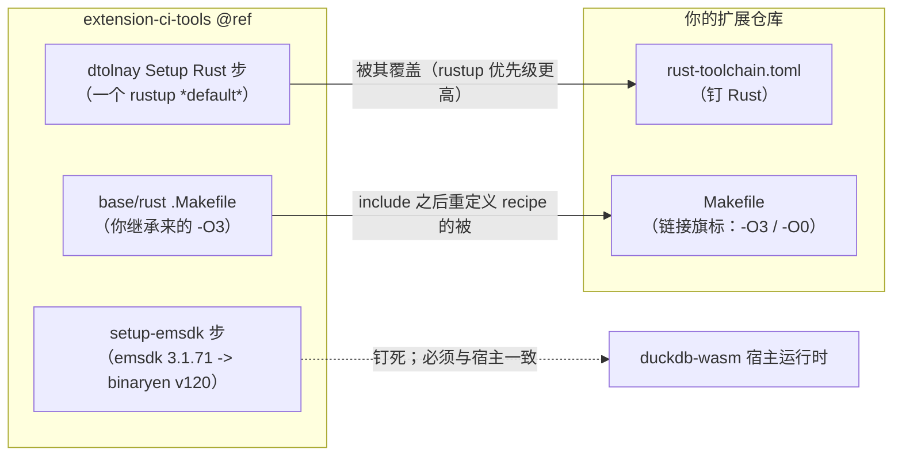
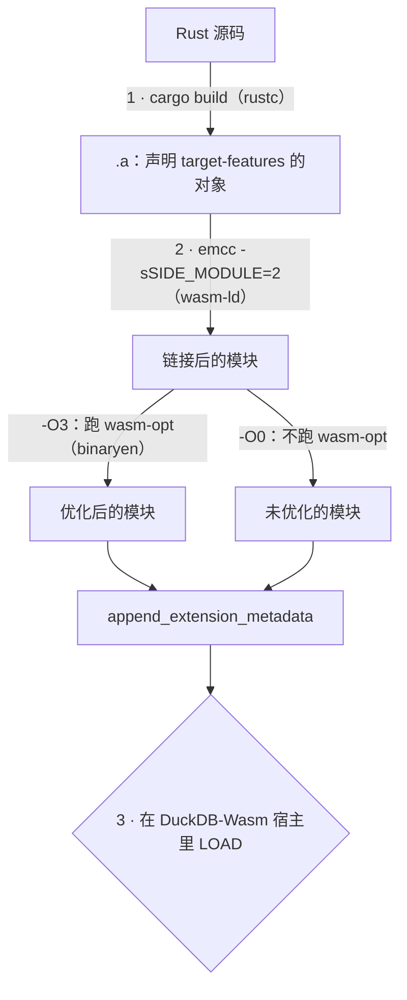
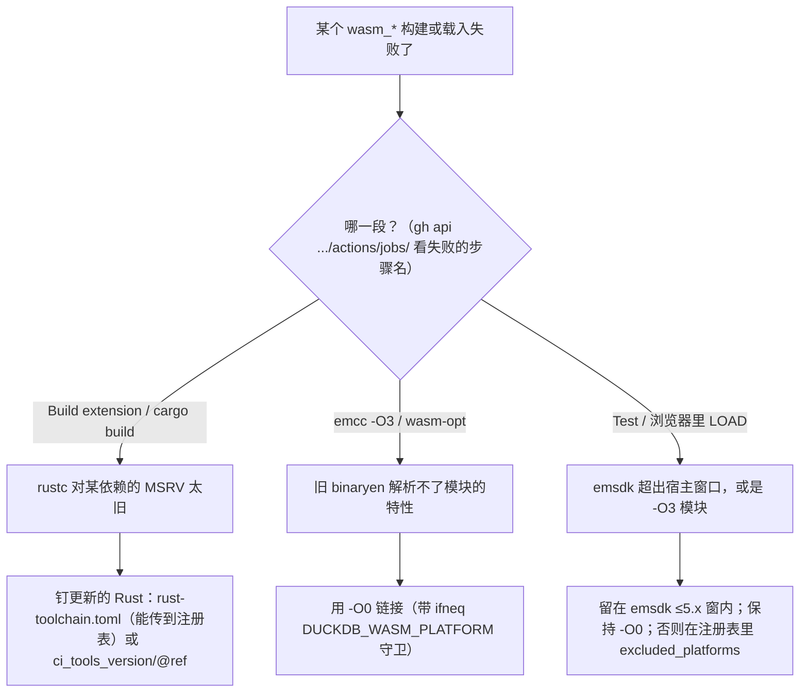

# wasm 构建工具链

[版本数字与 ABI 兼容性](./c-api-and-abi.md) 讲的是产物面向**哪个 DuckDB**。产出 `wasm_*` 产物是另一套更麻烦的版本问题：三个
旋钮必须对齐，而**它们各自定在不同仓库里**，任一处不匹配就会在三段中的某一段失败。本页把整个排查过程
记下来 —— 失败模式、实测的兼容窗、可用的杠杆 —— 免得有人再从头推一遍。

## 三个旋钮，以及谁定的



| 旋钮 | 谁设定 | 控制什么 |
| --- | --- | --- |
| wasm 构建装的 **Rust 工具链** | 你调用的 ci-tools ref（`uses: .../_extension_distribution.yml@<ref>` 与 `ci_tools_version` 输入），可被仓库 `rust-toolchain.toml` 覆盖 | `cargo build` 收不收你的依赖树 |
| **emsdk / binaryen**（`3.1.71` → `wasm-opt` v120） | ci-tools 的 `setup-emsdk` 步 | `emcc` 的后链接优化器认识哪些 wasm 特性 |
| **链接旗标**（`-O3` vs `-O0`） | **你的 `Makefile`**（`link_wasm_release` / `link_wasm_debug`） | 那个优化器到底跑不跑 |

前两个由官方流水线钉住。emsdk 那条必须与宿主 DuckDB-Wasm 里烧进去的引擎一致，否则模块 `LOAD` 不进来
—— 所以它基本动不了（下面兼容窗说明它到底有多少余量）。

## 构建是一条流水线，会在三个点上断



1. **编译** —— 某个依赖需要的 `rustc` 比 CI 装的更新。
2. **链接** —— `emcc -O3` 把较新的 target-feature 喂给解析不了的 binaryen。
3. **载入** —— 模块（来自太新的 emsdk，或来自 `-O3`）被宿主运行时拒。

### 1 · 编译：Rust 钉版（那段「Rust 1.86」的往事）

可复用工作流为 wasm job 装一个指定的 Rust，而它历史上**落后于 native job**：native 用 `stable`（1.97.1），
而 wasm 的 "Build Wasm module" / "Setup Rust for cross compilation" 步仍钉 `dtolnay/rust-toolchain@1.86.0`。
于是任何需要更新语言特性的依赖，只让 `wasm_*` 作业失败，而 `linux_amd64`、`osx_*`、`windows_*` 全过：

```text
error: rustc 1.86.0 is not supported by the following packages:
  <crate> requires rustc 1.89
```

—— 根本到不了 `emcc`。这就是 ci-tools 的 [issue #385](https://github.com/duckdb/extension-ci-tools/issues/385)，
被 [PR #394](https://github.com/duckdb/extension-ci-tools/pull/394) 关闭（把 wasm 的 Rust 抬到 1.97.1、与
native 统一）。**但这个提升只活在含 #394 的 ci-tools ref 里** —— 像 `@v1.5-variegata` 这种在合并前切出的
ref，仍带 `1.86.0`。

两个杠杆，分处不同层：

- **抬 `ci_tools_version` / `@ref`** 到含该修复的 ref。简单、走官方路子 —— 但只作用于*你自己的*发布流水线。
- **在仓库根放 `rust-toolchain.toml`**（`channel = "1.97.1"`、`targets = ["wasm32-unknown-emscripten"]`）。
  `dtolnay/rust-toolchain` action 只设一个 rustup **default**，而 `rust-toolchain.toml` 优先级高于该
  default，于是 `cargo` 用钉定的工具链（rustup 自动补装）。因为文件在仓库里，它也随社区注册表的
  `override_ref` 一起生效 —— 而 `ci_tools_version` 抬版做不到（见下）。

### 2 · 链接：现代 Rust 产出的特性，旧 binaryen 解析不了

较新的 Rust（`>=1.89`）为 `wasm32-unknown-emscripten` 编出的模块会声明一批 post-MVP 的 target-feature ——
`exception-handling`、`bulk-memory-opt`，以及模块大到一定程度（函数类型多 → indirect-call 表超长）时的
`call-indirect-overlong`。`emcc` 读这些声明并转成 `--enable-*` 传给 `wasm-opt`。emsdk 3.1.71 带的是 binaryen
v120，认不全这些新名字，于是 `emcc -O3` 挂：

```text
Unknown option '--enable-bulk-memory-opt'
emcc: error: '...wasm-opt ... --enable-call-indirect-overlong ...' failed (returned 1)
```

`wasm-opt` 只是**优化器**；`wasm-ld` 的模块本身合法、在 DuckDB-Wasm 里加载正常。所以在保留完整功能的前提
下，出路是**跳过优化器**：把链接覆盖成 `-O0`，写在 `include` **之后**以压过 `base.Makefile` —— 且要和 base
用**同一个** `ifneq ($(DUCKDB_WASM_PLATFORM),)` 守卫，否则连（空的）原生目标也被重定义，linux/macos/windows
构建会报 `emcc: command not found`：

```make
# Makefile，在 include extension-ci-tools/.../base.Makefile 之后
ifneq ($(DUCKDB_WASM_PLATFORM),)
link_wasm_debug:
	emcc $(EXTENSION_BUILD_PATH)/debug/$(EXTENSION_LIB_FILENAME) -o $(EXTENSION_BUILD_PATH)/debug/$(EXTENSION_FILENAME_NO_METADATA) -O0 -g -sSIDE_MODULE=2 -sEXPORTED_FUNCTIONS="_$(EXTENSION_NAME)_init_c_api"

link_wasm_release:
	emcc $(EXTENSION_BUILD_PATH)/release/$(EXTENSION_LIB_FILENAME) -o $(EXTENSION_BUILD_PATH)/release/$(EXTENSION_FILENAME_NO_METADATA) -O0 -sSIDE_MODULE=2 -sEXPORTED_FUNCTIONS="_$(EXTENSION_NAME)_init_c_api"
endif
```

### 3 · 载入：宿主只接受一个 emsdk 窗口，且只接受 `-O0` 产物

把 side module 载入 DuckDB-Wasm，需要它的 emscripten 运行时 import 与宿主对得上。针对被 pin 的宿主
`@duckdb/duckdb-wasm 1.33.1-dev65.0`（约 3.1.71 编）—— 拿同一份 `duckfn_statrs` 的 `.a`，用不同 emsdk
克隆去链，再跑浏览器 harness（`just test_wasm` → Playwright → DuckDB-Wasm），**只**翻 emsdk 和 `-O` 级别：

**emsdk 版本（固定 `-O0`）：**

| 扩展用哪个 emsdk 链接 | 能构建 | 能载入宿主 |
| --- | --- | --- |
| emsdk 3.1.74 | ✓ | ✅ 554 块全过 |
| emsdk 4.0.23 | ✓ | ✅ 554 全过 |
| emsdk 5.0.7 | ✓ | ✅ 554 全过 |
| emsdk 6.0.0 | ✓ | ❌ `Could not load dynamic lib` |
| emsdk 6.0.10 | ✓ | ❌ `Could not load dynamic lib` |

**优化档（同一 emsdk、在兼容窗内）：**

| emsdk | `-O0`（跳过 binaryen） | `-O3`（binaryen 优化） |
| --- | --- | --- |
| 4.0.23 | ✅ 载入、全过 | ❌ `Could not load dynamic lib` |
| 5.0.7 | ✅ 载入、全过 | ❌ `Could not load dynamic lib` |

两条互相独立、可叠加的结论：

- **emsdk 那条是一个窗口、不是「必须一模一样」。** 整条 `5.x` 都能载入；断点是干脆的 emscripten **5→6**
  边界（`5.0.7` 能载、`6.0.0` 不能）。`-sSIDE_MODULE=2` 本身从没报错，即便在 6.x —— 被宿主拒的是*产出的
  那个模块*。
- **`-O0` 是载入必需，不只是绕开旧 binaryen 的权宜。** `-O3` 模块用较新 binaryen 能链接成功（它认得那些
  feature flag），却被宿主拒载；而*同一*工具链的 `-O0` 能载入。要退回 `-O3`，得等**宿主侧**的 wasm 运行时
  （不只是扩展用的 emsdk）也确认能接受 binaryen 优化过的 side module。顺带：`-O3` 产物反而**更大**
  （约 1.93MB vs 约 1.52MB）—— 这版 binaryen 优化的是速度、不是体积。

## CI 不读你的 `extension-ci-tools` 子模块

子模块只是**本地** `just build` / `make` / `just test_wasm` 用的 makefile 来源。GitHub CI 会**忽略**你子模块
钉的 commit：它按 `uses: ...@<ref>` 取可复用工作流，又按 `ci_tools_version` 把 `extension-ci-tools` 重新
checkout 到同一路径。所以你本地跑的那套 wasm 工具链可能和 CI（及注册表）用的不一致 —— 把本地子模块 ref、
`@ref`、`ci_tools_version` 三者对齐，否则「本地绿」不等于「CI 绿」。

## 社区注册表的构建用的是它自己的钉法

`duckdb/community-extensions/.github/workflows/build.yml` 以**它自己**的 ci-tools ref / `ci_tools_version`
默认值调 `_extension_distribution.yml`，只额外传 `override_repository` + `override_ref`（你的仓库与提交
SHA）。所以你项目里的 `ci_tools_version` **既传不到注册表、也左右不了它的 Rust 选择** —— 一旦注册表钉的
Rust 低于你的依赖 MSRV，它的 wasm job 会以同样的方式失败。抬 `ci_tools_version` 帮不上，但仓库里的
`rust-toolchain.toml` **却能传到注册表**（它随 `override_ref` 走）。于是项目侧的杠杆是：用
`rust-toolchain.toml` 钉住 Rust，或在 `description.yml` 里排除 wasm：

```yaml
extension:
  excluded_platforms: "wasm_mvp;wasm_eh;wasm_threads"
```

等注册表的 ci-tools 越过 #394 后再删掉这行。见[社区扩展文档页](../community-extension-docs.md)。

## 诊断你自己的情况



- 逐字节对比两个 `.a` 里的特性字符串（`bulk-memory-opt`、`call-indirect-overlong`、`exception-handling`），
  看是哪份产物在要求更新的 binaryen。
- 确认每个目录真正在用的 Rust：`rustc --version`、`rustup override list`，并记住 `rust-toolchain.toml`
  优先级高于 CI action 设的 rustup default。
- CI 侧：`gh run view <id> --json jobs` 看各平台结论，`gh api .../actions/jobs/<job>` 看失败的**步骤名**
  （编译 vs 链接 vs 测试），整轮跑完后再 `gh run view --job=<id> --log` 取日志。

## 实例：`duckfn_statrs`

`duckfn_statrs` 包 `statrs 0.19` / `nalgebra 0.35`（需 rustc ≥ 1.89）。在 `@v1.5-variegata` 钉法下它的 wasm
job 卡在 #385 的 1.86。采用的做法是**保持 `v1.5-variegata` 不变**、从**仓库自身**覆盖 Rust —— 根目录
`rust-toolchain.toml`（`channel = "1.97.1"` + wasm target，优先级高于 dtolnay 的 default，且能传到注册表）
**加上**上面的 `-O0` 链接覆盖（旧 binaryen → 跳过优化器）。结果：`just test_wasm` 全绿（554/0），在钉住的
ref 上一次 `workflow_dispatch` 构建出九平台含三个 `wasm_*`（约 1.5MB，未优化）。（更早一版是借
`ci_tools_version: main` 拿 1.97.1；改用仓库内文件更佳，因为它能一并传播到注册表。）

注意：wasm 构建**并不**依赖 DuckDB 2.0 是否发布 —— 它仍面向 DuckDB 1.5.x。而且这份扩展的*稳定*产物已经能在
DuckDB **2.0** 预发布引擎上加载并运行（见[版本数字与 ABI 兼容性](./c-api-and-abi.md)里「稳定区的一份产物到底覆盖到哪」）—— 不过
「加载兼容」和「构建目标」仍是两码事。

另外，wasm 上的 **`panic!` / `catch_unwind` 行为同样取决于 Rust 版本**（是同一次排查里测出来的），单开了一页：
[Wasm 下的 panic 处理](./rust-wasm-unwinding.md)。
